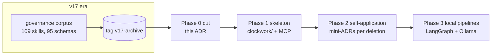

# Phase 0: Cut & ADR Foundation — Implementation Plan

> **For agentic workers:** REQUIRED SUB-SKILL: Use superpowers:subagent-driven-development (recommended) or superpowers:executing-plans to implement this plan task-by-task. Steps use checkbox (`- [ ]`) syntax for tracking.

**Goal:** Archive the v17 era, normalize the docs tree to lowercase, scaffold the ADR corpus, write ADR-CW-0001, and delete all decision-free junk (~610 MB).

**Architecture:** No runtime code in this phase — git surgery plus the documentation foundation every later phase builds on.

**Tech Stack:** git, Markdown, Mermaid.

## Global Constraints

See `2026-07-10-reboot-overview.md` — applies verbatim. Working branch `reboot/bootstrap-slice`; filesystem is case-insensitive; every ADR needs a catalog row and a Mermaid block in the same commit.

---

### Task 0.1: Archive tag

**Files:** none (git metadata only)

**Interfaces:**
- Consumes: existing history; last pre-reboot commit on master is `0a9a862` ("Added Reviewer Builder Skills").
- Produces: annotated tag `v17-archive` that all later ADRs may cite as the archive pointer.

- [ ] **Step 1: Verify the target commit exists and is the master tip**

Run: `git log --oneline -1 master`
Expected: `0a9a862 Added Reviewer Builder Skills`

- [ ] **Step 2: Create the annotated tag**

```bash
git tag -a v17-archive 0a9a862 -m "End of the v17 era. Everything before the reboot (governance corpus, 109 manifest skills, claudeclockwork package) is preserved here. See docs/ADR/adr-cw-0001-reboot-and-cut.md."
```

- [ ] **Step 3: Verify**

Run: `git tag -l v17-archive && git rev-parse v17-archive^{commit}`
Expected: `v17-archive` and `0a9a862...` (full hash starting with 0a9a862)

No commit needed (tags are refs). Do **not** push unless the user asks.

---

### Task 0.2: Normalize `Docs/` → `docs/` (tracked case)

**Files:**
- Modify: every tracked path under `Docs/` becomes `docs/` (content unchanged)

**Interfaces:**
- Consumes: legacy `Docs/` tree (~300 KB audit files + `Docs/superpowers/` specs/plans).
- Produces: all docs tracked under lowercase `docs/`; later tasks may create `docs/ADR/`, `docs/architecture/` without case collisions.

- [ ] **Step 1: Two-step case rename (required on case-insensitive FS)**

```bash
git mv Docs docs_rename_tmp
git mv docs_rename_tmp docs
```

- [ ] **Step 2: Verify no capitalized paths remain in the index**

Run: `git ls-files | grep -c "^Docs/" || true; git ls-files | grep -c "^docs/"`
Expected: `0` for `Docs/`, a number ≥ 10 for `docs/`

- [ ] **Step 3: Commit**

```bash
git add -A
git commit -m "chore: normalize docs tree to lowercase (case-insensitive FS)"
```

---

### Task 0.3: ADR corpus scaffolding

**Files:**
- Create: `docs/ADR/README.md`
- Create: `docs/ADR/adr-template.md`
- Create: `docs/ADR/ADR-CATALOG.md`

**Interfaces:**
- Consumes: nothing.
- Produces: the authoring rules + catalog every subsequent ADR task uses. Catalog table columns: `ID | Title | Domain | Status | File`.

- [ ] **Step 1: Write `docs/ADR/README.md`**

```markdown
# ClaudeClockwork ADRs

Architecture Decision Records for the rebooted Clockwork. Single ID stream
`ADR-CW-NNNN` with a domain column in the catalog; domain-split numbering is
deferred until the catalog needs it.

## Rules

- File name: `adr-cw-NNNN-<slug>.md`, IDs never reused.
- Every ADR is registered in [ADR-CATALOG.md](ADR-CATALOG.md) in the same
  commit that adds or changes it (same-change anchoring).
- Every ADR contains at least one fenced `mermaid` diagram.
- Statuses: `proposed` → `accepted` → (`superseded-by-<ID>` | `retired`).
- When a SAD consolidates an ADR, the SAD frontmatter lists it under
  `owns-adrs` and the ADR status notes the owning SAD.
- ADRs cite evidence (files, tags, test names), not conversation memory.
  The pre-reboot state is always citable as tag `v17-archive`.

## Lookup order

1. [ADR-CATALOG.md](ADR-CATALOG.md) for a keyword/domain match.
2. The owning SAD under `docs/architecture/` before changing cross-cutting behavior.
3. The UML package linked from the SAD frontmatter (`uml-package`).
```

- [ ] **Step 2: Write `docs/ADR/adr-template.md`**

```markdown
---
id: ADR-CW-NNNN
status: proposed
date: YYYY-MM-DD
domain: core | tools | pipelines | governance | cleanup
---

# ADR-CW-NNNN: <Title>

## Context

<What situation forces a decision? Cite files/tags/tests as evidence.>

## Decision

<The decision, in one or two sentences. Then the details.>

## Consequences

<What becomes easier, what becomes harder, what is now forbidden.>

## Diagrams


```

- [ ] **Step 3: Write `docs/ADR/ADR-CATALOG.md`**

```markdown
# ADR Catalog

Machine-oriented index. Search here first.

| ID | Title | Domain | Status | File |
|---|---|---|---|---|
```

- [ ] **Step 4: Commit**

```bash
git add docs/ADR/
git commit -m "docs: scaffold ADR corpus (rules, template, catalog)"
```

---

### Task 0.4: ADR-CW-0001 — Reboot and cut

**Files:**
- Create: `docs/ADR/adr-cw-0001-reboot-and-cut.md`
- Modify: `docs/ADR/ADR-CATALOG.md` (add row)

**Interfaces:**
- Consumes: template from Task 0.3; tag from Task 0.1.
- Produces: the normative record Phase 0 Task 0.5 (deletion) and all Phase 2 mini-ADRs reference.

- [ ] **Step 1: Write `docs/ADR/adr-cw-0001-reboot-and-cut.md`**

```markdown
---
id: ADR-CW-0001
status: accepted
date: 2026-07-10
domain: governance
---

# ADR-CW-0001: Reboot Clockwork in the same repo; archive v17 via git history

## Context

ClaudeClockwork v17.x (last commit 2026-03-30, tag `v17-archive`) never worked
reliably: a governance-markdown corpus (109 manifest skills, ~95 JSON schemas,
agent hierarchy, escalation levels) that no runtime enforced end-to-end,
hard-blocking rules (Ollama FREEZE), and ~700 MB of accumulated artifacts.
The full analysis and the approved target design live in
`docs/superpowers/specs/2026-07-10-clockwork-reboot-design.md`.

## Decision

Restart in the same repository. Git history (tag `v17-archive`) is the only
archive. Only the UML suite, the reviewer builder, and the Ollama runtime
essentials are ported (Phase 1/3). Decision-free junk is deleted immediately
(this ADR); every decision-bearing deletion gets its own short ADR (Phase 2).
The new system is defined by ADR/SAD/UML artifacts validated by gate tests,
not by process prose.

Deleted as decision-free junk (not tracked or pure artifact output):
`.clockwork_runtime/`, `.worktrees/`, `claudeclockwork.zip`, `.DEPRECATED/`,
`.ollama_old/`, `.ollama_from_wos/`, `.llama_runtime/`, `.pytest_cache/`,
`validation_runs/`, `validation_runs_redacted/`, `cleanup_request.json`,
`cleanup_run.log`, `phase6_evidence_bundle.json`, stray root file `skills`.

## Consequences

- The repo shrinks by ~610 MB; nothing is lost (git history + tag).
- No code or doc may cite the deleted paths as live locations anymore.
- Every future structural decision requires an ADR in the same change.
- The FREEZE rule is retired; degradation policy is decided in the
  pipelines ADR (Phase 3).

## Diagrams


```

- [ ] **Step 2: Add the catalog row**

Append to the table in `docs/ADR/ADR-CATALOG.md`:

```markdown
| ADR-CW-0001 | Reboot Clockwork in the same repo; archive v17 | governance | accepted | [adr-cw-0001-reboot-and-cut.md](adr-cw-0001-reboot-and-cut.md) |
```

- [ ] **Step 3: Commit**

```bash
git add docs/ADR/
git commit -m "docs: ADR-CW-0001 reboot and cut decision"
```

---

### Task 0.5: Delete decision-free junk

**Files:**
- Delete: `.clockwork_runtime/`, `.worktrees/`, `claudeclockwork.zip`, `.DEPRECATED/`, `.ollama_old/`, `.ollama_from_wos/`, `.llama_runtime/`, `.pytest_cache/`, `validation_runs/`, `validation_runs_redacted/`, `cleanup_request.json`, `cleanup_run.log`, `phase6_evidence_bundle.json`, `skills` (37-byte stray file)

**Interfaces:**
- Consumes: ADR-CW-0001 (authorizes exactly this list).
- Produces: a repo without artifact ballast; later phases assume these paths do not exist.

- [ ] **Step 1: Record the starting size**

Run: `du -sh /mnt/d/ClaudeClockwork`
Expected: something around 900 MB–1 GB (record the number for the commit message).

- [ ] **Step 2: Delete (tracked and untracked alike)**

```bash
cd /mnt/d/ClaudeClockwork
for p in .clockwork_runtime .worktrees claudeclockwork.zip .DEPRECATED \
         .ollama_old .ollama_from_wos .llama_runtime .pytest_cache \
         validation_runs validation_runs_redacted cleanup_request.json \
         cleanup_run.log phase6_evidence_bundle.json skills; do
  git rm -r -q --ignore-unmatch "$p"
  rm -rf "$p"
done
```

Caution: the deletion list is exactly the ADR-CW-0001 list. Do not add paths ad hoc — anything else needs its own ADR (Phase 2).

- [ ] **Step 3: Verify the paths are gone and nothing else changed**

Run: `git status --short | grep -v "^D " | grep -v "^ D" || echo CLEAN-EXCEPT-DELETES`
Expected: `CLEAN-EXCEPT-DELETES` (only deletions staged)

Run: `du -sh /mnt/d/ClaudeClockwork`
Expected: roughly 610 MB smaller than Step 1 (the `.git/` dir keeps history; that is intended).

- [ ] **Step 4: Commit**

```bash
git commit -m "chore: delete decision-free junk per ADR-CW-0001 (~610 MB)"
```

---

### Task 0.6: Update spec risk note + phase verification

**Files:**
- Modify: `docs/superpowers/specs/2026-07-10-clockwork-reboot-design.md` (risk section: the `Docs/`→`docs/` rename happened in Phase 0, not Phase 2)

**Interfaces:**
- Consumes: Task 0.2 result.
- Produces: spec consistent with reality.

- [ ] **Step 1: Edit the case-insensitivity risk bullet**

In section "9. Risks & Mitigations", replace the last bullet with:

```markdown
- **Case-insensitive filesystem (NTFS/WSL)**: `docs/` and legacy `Docs/` are the same directory on disk. Resolved in Phase 0 Task 0.2 by renaming the tracked tree to lowercase `docs/` before any new corpus files were added; legacy *content* inside `docs/` is still removed selectively in Phase 2.
```

- [ ] **Step 2: Phase verification**

Run: `git tag -l v17-archive && git ls-files | grep -c "^docs/ADR/" && ls .clockwork_runtime 2>&1`
Expected: tag listed; count `4` (README, template, catalog, adr-cw-0001); `ls: cannot access '.clockwork_runtime': No such file or directory`

- [ ] **Step 3: Commit**

```bash
git add docs/superpowers/specs/2026-07-10-clockwork-reboot-design.md
git commit -m "docs: spec risk note reflects Phase 0 docs-tree rename"
```
