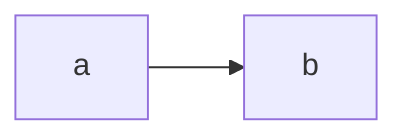
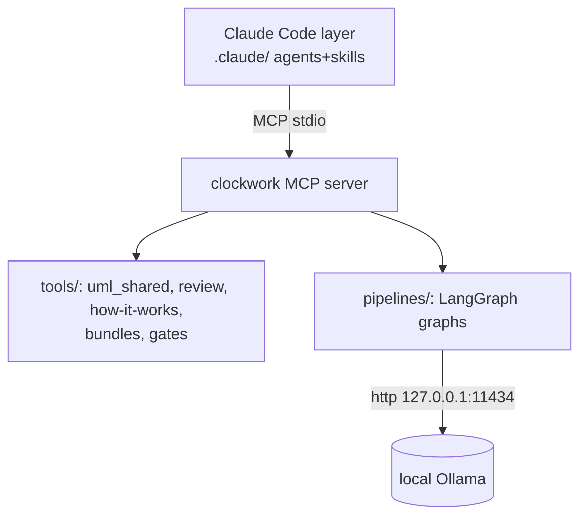

# Phase 1: Skeleton + MCP Server — Implementation Plan

> **For agentic workers:** REQUIRED SUB-SKILL: Use superpowers:subagent-driven-development (recommended) or superpowers:executing-plans to implement this plan task-by-task. Steps use checkbox (`- [ ]`) syntax for tracking.

**Goal:** Create the new `clockwork/` package: ported UML suite + reviewer builder as plain functions, an architecture-documentation gate, and a FastMCP stdio server exposing everything — plus SAD-CORE, ADR-CW-0002 and the UML skeleton.

**Architecture:** The three legacy shared modules (`uml_shared`, `uml_review_shared`, `repo_how_it_works_shared`) are ported verbatim except for import rewrites (they are stdlib-only). The legacy `SkillBase` wrappers are replaced by plain functions in `clockwork/tools/bundles.py`. Gate logic lives in `clockwork/tools/gates.py` and is consumed by both pytest and the MCP server.

**Tech Stack:** Python ≥3.10, `mcp` (FastMCP), PyYAML, pytest.

## Global Constraints

See `2026-07-10-reboot-overview.md`. Additional Phase 1 rules:
- Legacy sources under `.claude/skills/analysis/` still exist during this phase (deleted in Phase 2) — read them when porting; never import from them.
- New tests live under `tests/clockwork/` and `tests/gates/`. Run only these (legacy `tests/` is removed in Phase 2): `python3 -m pytest tests/clockwork tests/gates -v`.
- Errors in library code raise `UmlSkillError` (ported exception); MCP tool wrappers let exceptions propagate — FastMCP converts them to tool errors.

---

### Task 1.1: Package skeleton + packaging

**Files:**
- Create: `clockwork/__init__.py`, `clockwork/tools/__init__.py`, `clockwork/pipelines/__init__.py`
- Modify: `pyproject.toml` (full replacement below)
- Modify: `.gitignore` (add `UML/generated/`)
- Test: `tests/clockwork/test_package.py`, `tests/clockwork/__init__.py`, `tests/__init__.py` (only if missing)

**Interfaces:**
- Consumes: nothing.
- Produces: importable `clockwork` package, `clockwork.__version__ == "0.1.0"`; dependencies `mcp`, `pyyaml` installed; console script `clockwork-mcp`.

- [ ] **Step 1: Write the failing test**

`tests/clockwork/test_package.py`:

```python
def test_package_importable_and_versioned():
    import clockwork

    assert clockwork.__version__ == "0.1.0"
```

Create empty `tests/clockwork/__init__.py`.

- [ ] **Step 2: Run test to verify it fails**

Run: `python3 -m pytest tests/clockwork/test_package.py -v`
Expected: FAIL with `ModuleNotFoundError: No module named 'clockwork'`

- [ ] **Step 3: Create the package and packaging config**

`clockwork/__init__.py`:

```python
"""Clockwork — ADR/SAD/UML-anchored orchestration toolkit."""

__version__ = "0.1.0"
```

Create empty `clockwork/tools/__init__.py` and `clockwork/pipelines/__init__.py`.

Replace `pyproject.toml` entirely with:

```toml
[build-system]
requires = ["setuptools>=61", "wheel"]
build-backend = "setuptools.build_meta"

[project]
name = "claudeclockwork"
version = "0.1.0"
description = "ADR/SAD/UML-anchored multi-agent orchestration toolkit (Claude Code + MCP + local pipelines)"
readme = "README.md"
requires-python = ">=3.10"
license = { text = "MIT" }
authors = [{ name = "Clockwork" }]
dependencies = [
    "mcp>=1.2",
    "pyyaml>=6",
]

[project.optional-dependencies]
dev = ["pytest", "pytest-cov"]
local = ["langgraph>=1.0.3,<2", "httpx>=0.27"]

[project.scripts]
clockwork-mcp = "clockwork.server:main"

[tool.setuptools.packages.find]
where = ["."]
include = ["clockwork*"]

[tool.pytest.ini_options]
markers = [
    "integration: tests that need a live local Ollama backend",
]
testpaths = ["tests"]
```

Append to `.gitignore`:

```
UML/generated/
```

- [ ] **Step 4: Install and run the test**

Run: `python3 -m pip install -e ".[dev]" && python3 -m pytest tests/clockwork/test_package.py -v`
Expected: `Successfully installed claudeclockwork-0.1.0` (or already-satisfied deps) then PASS.

Note: the console script `clockwork-mcp` will fail to import until Task 1.7 creates `clockwork/server.py`; that is fine — nothing calls it yet.

- [ ] **Step 5: Commit**

```bash
git add clockwork/ tests/ pyproject.toml .gitignore
git commit -m "feat: clockwork package skeleton with mcp/pyyaml packaging"
```

---

### Task 1.2: Port `uml_shared`

**Files:**
- Create: `clockwork/tools/uml_shared.py` (copy of `.claude/skills/analysis/uml_shared.py`, unchanged — it is stdlib-only)
- Test: `tests/clockwork/test_uml_shared.py`

**Interfaces:**
- Consumes: nothing.
- Produces (used by Tasks 1.3–1.5): `scan_repository(repo_root: Path, include_tests: bool = False) -> RepoScan`, `RepoScan` (fields incl. `modules`, `module_count`, `class_count`, `languages`, `generated_notes`), `build_catalog(scan) -> dict`, `rank_directories(scan) -> list`, `find_scope_modules(scan, scope_kind, target) -> list[ModuleInfo]`, `expand_focus_modules(scan, base_modules, depth) -> list[ModuleInfo]`, `build_scope_summary(scope_kind, target, modules) -> dict`, `render_component_plantuml(...) -> str`, `render_dependency_mermaid(...) -> str`, `render_class_plantuml(...) -> str`, `render_markdown_index(...) -> str`, `sanitize_alias(text) -> str`, `write_text(path, content)`, `write_json(path, payload)`, `UmlSkillError`, `MAX_METHODS_PER_CLASS`.

- [ ] **Step 1: Write the failing test**

`tests/clockwork/test_uml_shared.py`:

```python
from pathlib import Path

from clockwork.tools.uml_shared import (
    render_component_plantuml,
    render_dependency_mermaid,
    scan_repository,
)


def make_mini_repo(tmp_path: Path) -> Path:
    pkg = tmp_path / "pkg"
    pkg.mkdir()
    (pkg / "alpha.py").write_text(
        "class Alpha:\n    def run(self):\n        return 1\n", encoding="utf-8"
    )
    (pkg / "beta.py").write_text(
        "from pkg.alpha import Alpha\n\n\ndef use():\n    return Alpha().run()\n",
        encoding="utf-8",
    )
    return tmp_path


def test_scan_finds_modules_and_classes(tmp_path):
    scan = scan_repository(make_mini_repo(tmp_path))
    module_ids = {m.module_id for m in scan.modules}
    assert "pkg.alpha" in module_ids
    assert "pkg.beta" in module_ids
    assert scan.class_count >= 1


def test_renderers_produce_diagram_sources(tmp_path):
    scan = scan_repository(make_mini_repo(tmp_path))
    puml = render_component_plantuml("t", scan.modules)
    mmd = render_dependency_mermaid("t", scan.modules)
    assert puml.startswith("@startuml")
    assert "flowchart" in mmd or "graph" in mmd
```

- [ ] **Step 2: Run test to verify it fails**

Run: `python3 -m pytest tests/clockwork/test_uml_shared.py -v`
Expected: FAIL with `ModuleNotFoundError: No module named 'clockwork.tools.uml_shared'`

- [ ] **Step 3: Port the module**

```bash
cp .claude/skills/analysis/uml_shared.py clockwork/tools/uml_shared.py
```

No edits required (verify: the file imports only `ast`, `json`, `re`, `collections`, `dataclasses`, `pathlib`, `typing`).

- [ ] **Step 4: Run test to verify it passes**

Run: `python3 -m pytest tests/clockwork/test_uml_shared.py -v`
Expected: 2 PASSED. If `test_scan_finds_modules_and_classes` fails on module IDs, inspect `build_module_id` — IDs are dot-joined relative paths without suffix; adjust the *assertion style* only if the actual ID format differs (e.g. `pkg.alpha` vs `alpha`), never the ported module.

- [ ] **Step 5: Commit**

```bash
git add clockwork/tools/uml_shared.py tests/clockwork/test_uml_shared.py
git commit -m "feat: port uml_shared scan/render core from v17 skills"
```

---

### Task 1.3: Port `uml_review_shared` + `repo_how_it_works_shared`

**Files:**
- Create: `clockwork/tools/uml_review_shared.py` (from `.claude/skills/analysis/uml_review_shared.py`)
- Create: `clockwork/tools/how_it_works_shared.py` (from `.claude/skills/analysis/repo_how_it_works_shared.py`)
- Test: `tests/clockwork/test_review_shared.py`

**Interfaces:**
- Consumes: `clockwork.tools.uml_shared` (Task 1.2).
- Produces (used by Task 1.4): `build_review_context(scan, neighbor_depth=1, max_neighbors=10) -> dict` (keys incl. `directories`, `modules`, `symbols`), `write_context_bundle(output_dir: Path, payload: dict) -> dict`, `write_review_site(output_dir: Path, context_payload: dict, site_title="UML Review Explorer", guide_payload: dict | None = None) -> dict`, `build_how_it_works_payload(scan, context_payload=None, repo_root=None) -> dict` (key `guides`), `write_how_it_works_bundle(output_dir: Path, payload: dict) -> dict`.

- [ ] **Step 1: Write the failing test**

`tests/clockwork/test_review_shared.py`:

```python
from clockwork.tools.how_it_works_shared import build_how_it_works_payload
from clockwork.tools.uml_review_shared import build_review_context, write_review_site
from clockwork.tools.uml_shared import scan_repository

from tests.clockwork.test_uml_shared import make_mini_repo


def test_review_context_covers_scanned_modules(tmp_path):
    scan = scan_repository(make_mini_repo(tmp_path))
    payload = build_review_context(scan)
    assert payload["modules"], "expected module entries"
    assert payload["directories"], "expected directory entries"


def test_review_site_and_guides_written(tmp_path):
    repo = make_mini_repo(tmp_path / "repo")
    scan = scan_repository(repo)
    context = build_review_context(scan)
    guide = build_how_it_works_payload(scan, context_payload=context, repo_root=repo)
    out = tmp_path / "site"
    write_review_site(out, context, guide_payload=guide)
    assert (out / "index.html").exists()
    assert (out / "modules").is_dir()
```

- [ ] **Step 2: Run test to verify it fails**

Run: `python3 -m pytest tests/clockwork/test_review_shared.py -v`
Expected: FAIL with `ModuleNotFoundError: No module named 'clockwork.tools.uml_review_shared'`

- [ ] **Step 3: Port both modules with import rewrite**

```bash
cp .claude/skills/analysis/uml_review_shared.py clockwork/tools/uml_review_shared.py
cp .claude/skills/analysis/repo_how_it_works_shared.py clockwork/tools/how_it_works_shared.py
sed -i 's/from skills\.analysis\.uml_shared import/from clockwork.tools.uml_shared import/' \
    clockwork/tools/uml_review_shared.py clockwork/tools/how_it_works_shared.py
```

Then edit `clockwork/tools/how_it_works_shared.py`: replace the legacy `IMPORTANT_DOCS` list with:

```python
IMPORTANT_DOCS = [
    'README.md',
    'CLAUDE.md',
    'docs/ADR/README.md',
    'docs/ADR/ADR-CATALOG.md',
    'UML/README.md',
]
```

(The list is a scan hint — entries that do not exist in a target repo are skipped.)

- [ ] **Step 4: Run test to verify it passes**

Run: `python3 -m pytest tests/clockwork/test_review_shared.py -v`
Expected: 2 PASSED. If `index.html` assertion fails, check `write_review_site`'s actual entry file name (`overview.html` vs `index.html`) in the ported source and fix the assertion to the real name — the site structure is ported behavior, not new design.

- [ ] **Step 5: Commit**

```bash
git add clockwork/tools/uml_review_shared.py clockwork/tools/how_it_works_shared.py tests/clockwork/test_review_shared.py
git commit -m "feat: port review-context/site and how-it-works modules"
```

---

### Task 1.4: Bundle functions (`bundles.py`)

**Files:**
- Create: `clockwork/tools/bundles.py`
- Test: `tests/clockwork/test_bundles.py`

**Interfaces:**
- Consumes: everything from Tasks 1.2–1.3.
- Produces (used by the MCP server, Task 1.7): seven plain functions, all returning JSON-serializable dicts and raising `UmlSkillError` on bad scopes:
  - `build_scope_catalog(repo_root, output_dir=None, include_tests=False) -> dict`
  - `build_repo_bundle(repo_root, output_dir=None, include_tests=False, max_directory_bundles=6) -> dict`
  - `build_focus_bundle(repo_root, scope_kind, target, neighbor_depth=2, include_methods=True, include_tests=False, output_dir=None) -> dict`
  - `generate_diagrams(repo_root, scope_kind="repo", target=None, include_methods=None, neighbor_depth=None, include_tests=False, output_dir=None) -> dict`
  - `build_review_context_bundle(repo_root, output_dir=None, include_tests=False, neighbor_depth=1, max_neighbors=10) -> dict`
  - `build_review_site_bundle(repo_root, output_dir=None, site_title="UML Review Explorer", include_tests=False, neighbor_depth=1, max_neighbors=10, include_guides=True) -> dict`
  - `build_how_it_works_bundle(repo_root, output_dir=None, include_tests=False, neighbor_depth=1, max_neighbors=10) -> dict`

- [ ] **Step 1: Write the failing test**

`tests/clockwork/test_bundles.py`:

```python
import json

import pytest

from clockwork.tools import bundles
from clockwork.tools.uml_shared import UmlSkillError

from tests.clockwork.test_uml_shared import make_mini_repo


def test_scope_catalog_writes_json_and_md(tmp_path):
    repo = make_mini_repo(tmp_path / "repo")
    out = tmp_path / "out"
    result = bundles.build_scope_catalog(repo, output_dir=out)
    payload = json.loads((out / "uml_scope_catalog.json").read_text(encoding="utf-8"))
    assert payload["summary"]["module_count"] >= 2
    assert (out / "uml_scope_catalog.md").exists()
    assert result["module_count"] >= 2


def test_repo_bundle_writes_overviews(tmp_path):
    repo = make_mini_repo(tmp_path / "repo")
    out = tmp_path / "out"
    result = bundles.build_repo_bundle(repo, output_dir=out)
    assert (out / "repo_component_overview.puml").exists()
    assert (out / "repo_dependency_overview.mmd").exists()
    assert (out / "README.md").exists()
    assert result["output_dir"] == str(out.resolve())


def test_focus_bundle_rejects_repo_scope(tmp_path):
    repo = make_mini_repo(tmp_path / "repo")
    with pytest.raises(UmlSkillError):
        bundles.build_focus_bundle(repo, scope_kind="repo", target="x")


def test_generate_diagrams_repo_scope(tmp_path):
    repo = make_mini_repo(tmp_path / "repo")
    out = tmp_path / "out"
    result = bundles.generate_diagrams(repo, output_dir=out)
    assert result["scope"]["module_count"] >= 2
    assert (out / "README.md").exists()


def test_review_and_guide_bundles(tmp_path):
    repo = make_mini_repo(tmp_path / "repo")
    ctx = bundles.build_review_context_bundle(repo, output_dir=tmp_path / "ctx")
    assert ctx["module_count"] >= 2
    site = bundles.build_review_site_bundle(repo, output_dir=tmp_path / "site")
    assert "output_dir" in site
    guide = bundles.build_how_it_works_bundle(repo, output_dir=tmp_path / "guide")
    assert "output_dir" in guide
```

- [ ] **Step 2: Run test to verify it fails**

Run: `python3 -m pytest tests/clockwork/test_bundles.py -v`
Expected: FAIL with `ImportError: cannot import name 'bundles'` (or ModuleNotFoundError)

- [ ] **Step 3: Implement `clockwork/tools/bundles.py`**

This is the wrapper logic of the six legacy `skill.py` files translated to plain functions (legacy sources: `.claude/skills/analysis/<name>/skill.py`; combo skills `uml_review_bundle` and `uml_review_knowledge_bundle` are intentionally dropped — callers compose the functions instead).

```python
"""Plain-function bundle builders (ported from v17 skill wrappers)."""

from __future__ import annotations

from pathlib import Path

from clockwork.tools.how_it_works_shared import (
    build_how_it_works_payload,
    write_how_it_works_bundle,
)
from clockwork.tools.uml_review_shared import (
    build_review_context,
    write_context_bundle,
    write_review_site,
)
from clockwork.tools.uml_shared import (
    UmlSkillError,
    build_catalog,
    build_scope_summary,
    expand_focus_modules,
    find_scope_modules,
    rank_directories,
    render_class_plantuml,
    render_component_plantuml,
    render_dependency_mermaid,
    render_markdown_index,
    sanitize_alias,
    scan_repository,
    write_json,
    write_text,
)

GENERATED_ROOT = Path("UML") / "generated"


def _resolve_out(repo_root: Path, output_dir: str | Path | None, default_leaf: str) -> Path:
    if output_dir:
        return Path(output_dir).resolve()
    return (repo_root / GENERATED_ROOT / default_leaf).resolve()


def build_scope_catalog(
    repo_root: str | Path,
    output_dir: str | Path | None = None,
    include_tests: bool = False,
) -> dict:
    repo_root = Path(repo_root).resolve()
    out = _resolve_out(repo_root, output_dir, "catalog")
    scan = scan_repository(repo_root, include_tests=include_tests)
    payload = build_catalog(scan)
    catalog_json = out / "uml_scope_catalog.json"
    catalog_md = out / "uml_scope_catalog.md"
    write_json(catalog_json, payload)
    write_text(
        catalog_md,
        render_markdown_index(
            title="UML Scope Catalog",
            description="Repository inventory for UML-friendly analysis and scope selection.",
            summary=payload["summary"],
            files=[catalog_json.name],
            notes=payload.get("notes", []),
        ),
    )
    return {
        "output_dir": str(out),
        "catalog_json": str(catalog_json),
        "catalog_md": str(catalog_md),
        "module_count": scan.module_count,
        "class_count": scan.class_count,
        "languages": scan.languages,
    }


def build_repo_bundle(
    repo_root: str | Path,
    output_dir: str | Path | None = None,
    include_tests: bool = False,
    max_directory_bundles: int = 6,
) -> dict:
    repo_root = Path(repo_root).resolve()
    out = _resolve_out(repo_root, output_dir, "repo_bundle")
    scan = scan_repository(repo_root, include_tests=include_tests)
    repo_summary = build_scope_summary("repo", None, scan.modules)
    top_directories = rank_directories(scan)[:max_directory_bundles]

    repo_component = out / "repo_component_overview.puml"
    repo_dependencies = out / "repo_dependency_overview.mmd"
    repo_classes = out / "repo_class_overview.puml"
    bundle_summary = out / "repo_bundle_summary.json"
    bundle_index = out / "README.md"

    write_text(repo_component, render_component_plantuml(
        "Repository UML / component overview", scan.modules, group_by="topdir"))
    write_text(repo_dependencies, render_dependency_mermaid(
        "Repository UML / dependency overview", scan.modules))
    write_text(repo_classes, render_class_plantuml(
        "Repository UML / class overview", scan.modules, include_methods=False))

    generated_files = [repo_component.name, repo_dependencies.name, repo_classes.name]
    slices: list[dict] = []
    for row in top_directories:
        directory = str(row["path"])
        if directory == ".":
            continue
        scope_modules = [
            m for m in scan.modules
            if m.file_path.startswith(directory + "/") or m.relative_dir == directory
        ]
        if not scope_modules:
            continue
        alias = sanitize_alias(f"dir_{directory}")
        component_file = out / f"{alias}_component.puml"
        class_file = out / f"{alias}_classes.puml"
        write_text(component_file, render_component_plantuml(
            f"Directory UML / {directory} / components", scope_modules, group_by="directory"))
        write_text(class_file, render_class_plantuml(
            f"Directory UML / {directory} / classes", scope_modules, include_methods=False))
        generated_files.extend([component_file.name, class_file.name])
        slices.append({
            "path": directory,
            "module_count": int(row["module_count"]),
            "class_count": int(row["class_count"]),
            "component_puml": component_file.name,
            "class_puml": class_file.name,
        })

    write_json(bundle_summary, {
        "repo_summary": repo_summary,
        "top_directories": top_directories,
        "slices": slices,
        "notes": scan.generated_notes,
    })
    write_text(bundle_index, render_markdown_index(
        title="Repository UML Bundle",
        description="Repository-wide UML overview with directory-level slices.",
        summary=repo_summary,
        files=generated_files + [bundle_summary.name],
        notes=scan.generated_notes,
    ))
    return {
        "output_dir": str(out),
        "bundle_index": str(bundle_index),
        "bundle_summary": str(bundle_summary),
        "slices": slices,
    }


def build_focus_bundle(
    repo_root: str | Path,
    scope_kind: str,
    target: str,
    neighbor_depth: int = 2,
    include_methods: bool = True,
    include_tests: bool = False,
    output_dir: str | Path | None = None,
) -> dict:
    repo_root = Path(repo_root).resolve()
    scope_kind = scope_kind.strip().lower()
    if scope_kind == "repo":
        raise UmlSkillError(
            "build_focus_bundle is for directory/module/symbol scopes; use build_repo_bundle.")
    if not target:
        raise UmlSkillError("Missing required target for build_focus_bundle.")

    scan = scan_repository(repo_root, include_tests=include_tests)
    base_modules = find_scope_modules(scan, scope_kind, target)
    if not base_modules:
        raise UmlSkillError(f"No modules found for scope {scope_kind}:{target}")

    scope_modules = expand_focus_modules(scan, base_modules, depth=neighbor_depth)
    alias = sanitize_alias(f"focus_{scope_kind}_{target}")
    out = _resolve_out(repo_root, output_dir, f"focus/{alias}")

    summary = build_scope_summary(scope_kind, target, scope_modules)
    component_overview = out / f"{alias}_component_overview.puml"
    neighborhood = out / f"{alias}_neighborhood.mmd"
    focused_classes = out / f"{alias}_focused_classes.puml"
    bundle_summary = out / f"{alias}_bundle.json"

    write_text(component_overview, render_component_plantuml(
        f"Focus bundle / {scope_kind}:{target} / components", scope_modules, group_by="directory"))
    write_text(neighborhood, render_dependency_mermaid(
        f"Focus bundle / {scope_kind}:{target} / neighborhood", scope_modules))
    write_text(focused_classes, render_class_plantuml(
        f"Focus bundle / {scope_kind}:{target} / classes", scope_modules,
        include_methods=include_methods))
    write_json(bundle_summary, {"summary": summary, "notes": scan.generated_notes})
    write_text(out / "README.md", render_markdown_index(
        title="UML Focus Bundle",
        description="Focused UML bundle with neighborhood expansion around the chosen scope.",
        summary=summary,
        files=[component_overview.name, neighborhood.name, focused_classes.name,
               bundle_summary.name],
        notes=scan.generated_notes,
    ))
    return {"output_dir": str(out), "scope": summary}


def generate_diagrams(
    repo_root: str | Path,
    scope_kind: str = "repo",
    target: str | None = None,
    include_methods: bool | None = None,
    neighbor_depth: int | None = None,
    include_tests: bool = False,
    output_dir: str | Path | None = None,
) -> dict:
    repo_root = Path(repo_root).resolve()
    scope_kind = scope_kind.strip().lower()
    if include_methods is None:
        include_methods = scope_kind == "symbol"
    if neighbor_depth is None:
        neighbor_depth = 1 if scope_kind in {"module", "symbol"} else 0

    scan = scan_repository(repo_root, include_tests=include_tests)
    base_modules = find_scope_modules(scan, scope_kind, target)
    if not base_modules:
        raise UmlSkillError(f"No modules found for scope {scope_kind}:{target}")

    scope_modules = expand_focus_modules(scan, base_modules, depth=neighbor_depth)
    alias = sanitize_alias(f"{scope_kind}_{target or 'repo'}")
    out = _resolve_out(repo_root, output_dir, f"scopes/{alias}")

    scope_title = f"UML scope: {scope_kind}::{target or 'repo'}"
    summary = build_scope_summary(scope_kind, target, scope_modules)
    component_puml = out / f"{alias}_component.puml"
    dependency_mmd = out / f"{alias}_dependencies.mmd"
    class_puml = out / f"{alias}_classes.puml"
    summary_json = out / f"{alias}_summary.json"

    write_text(component_puml, render_component_plantuml(
        f"{scope_title} / component overview", scope_modules, group_by="directory"))
    write_text(dependency_mmd, render_dependency_mermaid(
        f"{scope_title} / dependencies", scope_modules))
    write_text(class_puml, render_class_plantuml(
        f"{scope_title} / classes", scope_modules, include_methods=include_methods))
    write_json(summary_json, summary)
    write_text(out / "README.md", render_markdown_index(
        title="UML Scope Diagram Set",
        description="Generated diagrams for a focused repository scope.",
        summary=summary,
        files=[component_puml.name, dependency_mmd.name, class_puml.name, summary_json.name],
        notes=scan.generated_notes,
    ))
    return {"output_dir": str(out), "scope": summary}


def build_review_context_bundle(
    repo_root: str | Path,
    output_dir: str | Path | None = None,
    include_tests: bool = False,
    neighbor_depth: int = 1,
    max_neighbors: int = 10,
) -> dict:
    repo_root = Path(repo_root).resolve()
    out = _resolve_out(repo_root, output_dir, "review_context")
    scan = scan_repository(repo_root, include_tests=include_tests)
    payload = build_review_context(scan, neighbor_depth=neighbor_depth,
                                   max_neighbors=max_neighbors)
    written = write_context_bundle(out, payload)
    return {
        "output_dir": str(out),
        **written,
        "directory_count": len(payload["directories"]),
        "module_count": len(payload["modules"]),
        "symbol_count": len(payload["symbols"]),
    }


def build_review_site_bundle(
    repo_root: str | Path,
    output_dir: str | Path | None = None,
    site_title: str = "UML Review Explorer",
    include_tests: bool = False,
    neighbor_depth: int = 1,
    max_neighbors: int = 10,
    include_guides: bool = True,
) -> dict:
    repo_root = Path(repo_root).resolve()
    out = _resolve_out(repo_root, output_dir, "review_site")
    scan = scan_repository(repo_root, include_tests=include_tests)
    payload = build_review_context(scan, neighbor_depth=neighbor_depth,
                                   max_neighbors=max_neighbors)
    guide_payload = (
        build_how_it_works_payload(scan, context_payload=payload, repo_root=repo_root)
        if include_guides else None
    )
    written = write_review_site(out, payload, site_title=site_title,
                                guide_payload=guide_payload)
    return {"output_dir": str(out), **written}


def build_how_it_works_bundle(
    repo_root: str | Path,
    output_dir: str | Path | None = None,
    include_tests: bool = False,
    neighbor_depth: int = 1,
    max_neighbors: int = 10,
) -> dict:
    repo_root = Path(repo_root).resolve()
    out = _resolve_out(repo_root, output_dir, "how_it_works")
    scan = scan_repository(repo_root, include_tests=include_tests)
    context_payload = build_review_context(scan, neighbor_depth=neighbor_depth,
                                           max_neighbors=max_neighbors)
    payload = build_how_it_works_payload(scan, context_payload=context_payload,
                                         repo_root=repo_root)
    written = write_how_it_works_bundle(out, payload)
    return {"output_dir": str(out), **written, "guide_count": len(payload["guides"])}
```

- [ ] **Step 4: Run test to verify it passes**

Run: `python3 -m pytest tests/clockwork/test_bundles.py -v`
Expected: 5 PASSED

- [ ] **Step 5: Commit**

```bash
git add clockwork/tools/bundles.py tests/clockwork/test_bundles.py
git commit -m "feat: bundle builder functions replacing v17 skill wrappers"
```

---

### Task 1.5: Gate logic (`gates.py`)

**Files:**
- Create: `clockwork/tools/gates.py`
- Test: `tests/clockwork/test_gates.py`

**Interfaces:**
- Consumes: PyYAML.
- Produces (used by Task 1.6 pytest gate and Task 1.7 server): `check_architecture_docs(repo_root: str | Path) -> list[str]` — returns human-readable violation strings, empty list = gate passes.

Checks performed:
1. Every `docs/architecture/**/architecture.md` has YAML frontmatter with keys `id`, `status`, `type`, `owns-adrs`, `uml-package`.
2. Every `docs/ADR/adr-cw-*.md` has frontmatter (`id`, `status`, `date`, `domain`), contains a ` ```mermaid ` fence, and its `id` appears in `docs/ADR/ADR-CATALOG.md`.
3. Every `ADR-CW-` ID mentioned in the catalog has an existing file in the same row.
4. Every ADR listed in a SAD's `owns-adrs` exists in the catalog.
5. Every directory `UML/Components/*/` contains `README.md` and `TRACEABILITY.md`.
6. Every relative Markdown link in `docs/ADR/**/*.md` and `docs/architecture/**/*.md` resolves to an existing file (http(s), mailto and `#` anchors are skipped).

- [ ] **Step 1: Write the failing test**

`tests/clockwork/test_gates.py`:

```python
from pathlib import Path

from clockwork.tools.gates import check_architecture_docs

ADR_OK = """---
id: ADR-CW-0001
status: accepted
date: 2026-07-10
domain: governance
---
# ADR-CW-0001: Test

## Diagrams


"""

CATALOG_OK = """# ADR Catalog

| ID | Title | Domain | Status | File |
|---|---|---|---|---|
| ADR-CW-0001 | Test | governance | accepted | [adr-cw-0001-test.md](adr-cw-0001-test.md) |
"""

SAD_OK = """---
id: SAD-CW-TEST
status: accepted
type: project-sad
owns-adrs:
  - ADR-CW-0001
uml-package: UML/Components/test-core
links: []
---
# Test SAD
"""


def make_docs_repo(tmp_path: Path) -> Path:
    adr_dir = tmp_path / "docs" / "ADR"
    adr_dir.mkdir(parents=True)
    (adr_dir / "adr-cw-0001-test.md").write_text(ADR_OK, encoding="utf-8")
    (adr_dir / "ADR-CATALOG.md").write_text(CATALOG_OK, encoding="utf-8")
    sad_dir = tmp_path / "docs" / "architecture" / "core"
    sad_dir.mkdir(parents=True)
    (sad_dir / "architecture.md").write_text(SAD_OK, encoding="utf-8")
    comp = tmp_path / "UML" / "Components" / "test-core"
    comp.mkdir(parents=True)
    (comp / "README.md").write_text("# test-core\n", encoding="utf-8")
    (comp / "TRACEABILITY.md").write_text("# Traceability\n", encoding="utf-8")
    return tmp_path


def test_clean_corpus_passes(tmp_path):
    assert check_architecture_docs(make_docs_repo(tmp_path)) == []


def test_uncataloged_adr_fails(tmp_path):
    repo = make_docs_repo(tmp_path)
    (repo / "docs" / "ADR" / "adr-cw-0002-rogue.md").write_text(
        ADR_OK.replace("ADR-CW-0001", "ADR-CW-0002"), encoding="utf-8")
    violations = check_architecture_docs(repo)
    assert any("ADR-CW-0002" in v and "catalog" in v.lower() for v in violations)


def test_adr_without_mermaid_fails(tmp_path):
    repo = make_docs_repo(tmp_path)
    adr = repo / "docs" / "ADR" / "adr-cw-0001-test.md"
    adr.write_text(ADR_OK.replace("```mermaid", "```text"), encoding="utf-8")
    violations = check_architecture_docs(repo)
    assert any("mermaid" in v.lower() for v in violations)


def test_missing_traceability_fails(tmp_path):
    repo = make_docs_repo(tmp_path)
    (repo / "UML" / "Components" / "test-core" / "TRACEABILITY.md").unlink()
    violations = check_architecture_docs(repo)
    assert any("TRACEABILITY" in v for v in violations)


def test_broken_relative_link_fails(tmp_path):
    repo = make_docs_repo(tmp_path)
    adr = repo / "docs" / "ADR" / "adr-cw-0001-test.md"
    adr.write_text(ADR_OK + "\nSee [missing](does-not-exist.md).\n", encoding="utf-8")
    violations = check_architecture_docs(repo)
    assert any("does-not-exist.md" in v for v in violations)
```

- [ ] **Step 2: Run test to verify it fails**

Run: `python3 -m pytest tests/clockwork/test_gates.py -v`
Expected: FAIL with `ModuleNotFoundError: No module named 'clockwork.tools.gates'`

- [ ] **Step 3: Implement `clockwork/tools/gates.py`**

```python
"""Architecture documentation gate — shared by pytest and the MCP server."""

from __future__ import annotations

import re
from pathlib import Path

import yaml

SAD_REQUIRED_KEYS = ("id", "status", "type", "owns-adrs", "uml-package")
ADR_REQUIRED_KEYS = ("id", "status", "date", "domain")
LINK_PATTERN = re.compile(r"\[[^\]]*\]\(([^)\s]+)\)")
ADR_ID_PATTERN = re.compile(r"ADR-CW-\d{4}")


def _frontmatter(text: str) -> dict | None:
    if not text.startswith("---\n"):
        return None
    end = text.find("\n---", 4)
    if end == -1:
        return None
    try:
        data = yaml.safe_load(text[4:end])
    except yaml.YAMLError:
        return None
    return data if isinstance(data, dict) else None


def _check_links(md_file: Path, repo_root: Path, violations: list[str]) -> None:
    text = md_file.read_text(encoding="utf-8")
    for target in LINK_PATTERN.findall(text):
        if target.startswith(("http://", "https://", "mailto:", "#")):
            continue
        clean = target.split("#", 1)[0]
        if not clean:
            continue
        resolved = (md_file.parent / clean).resolve()
        if not resolved.exists():
            violations.append(
                f"{md_file.relative_to(repo_root)}: broken link -> {target}")


def check_architecture_docs(repo_root: str | Path) -> list[str]:
    repo_root = Path(repo_root).resolve()
    violations: list[str] = []

    adr_dir = repo_root / "docs" / "ADR"
    catalog_file = adr_dir / "ADR-CATALOG.md"
    catalog_text = catalog_file.read_text(encoding="utf-8") if catalog_file.exists() else ""
    catalog_ids = set(ADR_ID_PATTERN.findall(catalog_text))

    adr_files = sorted(adr_dir.glob("adr-cw-*.md")) if adr_dir.exists() else []
    adr_ids_on_disk: set[str] = set()
    for adr in adr_files:
        text = adr.read_text(encoding="utf-8")
        meta = _frontmatter(text)
        if meta is None:
            violations.append(f"{adr.name}: missing or invalid YAML frontmatter")
            continue
        for key in ADR_REQUIRED_KEYS:
            if key not in meta:
                violations.append(f"{adr.name}: frontmatter missing key '{key}'")
        adr_id = str(meta.get("id", ""))
        if adr_id:
            adr_ids_on_disk.add(adr_id)
            if adr_id not in catalog_ids:
                violations.append(f"{adr.name}: {adr_id} not registered in catalog")
        if "```mermaid" not in text:
            violations.append(f"{adr.name}: no mermaid diagram")
        _check_links(adr, repo_root, violations)

    for cataloged in sorted(catalog_ids - adr_ids_on_disk):
        violations.append(f"ADR-CATALOG.md: {cataloged} listed but no ADR file found")

    arch_dir = repo_root / "docs" / "architecture"
    sad_files = sorted(arch_dir.rglob("architecture.md")) if arch_dir.exists() else []
    for sad in sad_files:
        text = sad.read_text(encoding="utf-8")
        meta = _frontmatter(text)
        rel = sad.relative_to(repo_root)
        if meta is None:
            violations.append(f"{rel}: missing or invalid YAML frontmatter")
            continue
        for key in SAD_REQUIRED_KEYS:
            if key not in meta:
                violations.append(f"{rel}: frontmatter missing key '{key}'")
        for owned in meta.get("owns-adrs") or []:
            if str(owned) not in catalog_ids:
                violations.append(f"{rel}: owns-adrs entry {owned} not in catalog")
        _check_links(sad, repo_root, violations)

    components_dir = repo_root / "UML" / "Components"
    if components_dir.exists():
        for package in sorted(p for p in components_dir.iterdir() if p.is_dir()):
            for required in ("README.md", "TRACEABILITY.md"):
                if not (package / required).exists():
                    violations.append(
                        f"UML/Components/{package.name}: missing {required}")

    return violations
```

- [ ] **Step 4: Run test to verify it passes**

Run: `python3 -m pytest tests/clockwork/test_gates.py -v`
Expected: 5 PASSED

- [ ] **Step 5: Commit**

```bash
git add clockwork/tools/gates.py tests/clockwork/test_gates.py
git commit -m "feat: architecture documentation gate checks"
```

---

### Task 1.6: Docs corpus — ADR-CW-0002, SAD-CORE, UML skeleton, repo gate test

**Files:**
- Create: `docs/ADR/adr-cw-0002-three-layer-architecture.md`
- Modify: `docs/ADR/ADR-CATALOG.md` (add row)
- Create: `docs/architecture/core/architecture.md` (SAD-CORE)
- Create: `UML/README.md`, `UML/_templates/c4/README.md`, `UML/_templates/c4/TRACEABILITY.md`
- Test: `tests/gates/test_architecture_documentation_gate.py`, `tests/gates/__init__.py`

**Interfaces:**
- Consumes: `check_architecture_docs` (Task 1.5).
- Produces: a green gate over the real repository; the corpus later phases extend.

- [ ] **Step 1: Write the failing repo-level gate test**

`tests/gates/test_architecture_documentation_gate.py` (plus empty `tests/gates/__init__.py`):

```python
from pathlib import Path

from clockwork.tools.gates import check_architecture_docs

REPO_ROOT = Path(__file__).resolve().parents[2]


def test_architecture_documentation_gate():
    violations = check_architecture_docs(REPO_ROOT)
    assert violations == [], "\n".join(violations)
```

- [ ] **Step 2: Run to see the real gaps**

Run: `python3 -m pytest tests/gates/ -v`
Expected: FAIL — no SAD exists yet; possibly zero violations for ADRs if Phase 0 was done correctly. If it passes because `docs/architecture/` doesn't exist yet, that confirms the gate skips absent trees — continue; the test must be red or green *for the right reason* after Step 3.

- [ ] **Step 3: Write ADR-CW-0002**

`docs/ADR/adr-cw-0002-three-layer-architecture.md`:

```markdown
---
id: ADR-CW-0002
status: accepted
date: 2026-07-10
domain: core
---

# ADR-CW-0002: Three-layer architecture (Claude Code + MCP tools + local pipelines)

## Context

The v17 system mixed orchestration, governance prose, skill dispatch and
model routing into one custom pipeline that no runtime enforced. The reboot
spec (`docs/superpowers/specs/2026-07-10-clockwork-reboot-design.md`) fixes a
hybrid foundation.

## Decision

Clockwork consists of exactly three layers:

1. **Claude Code layer** (`.claude/`): a thin set of agents/skills; Claude
   Code is the orchestrator. No governance prose, no skill registry.
2. **MCP tool server** (`clockwork/` package, FastMCP over stdio): the seven
   bundle builders (scope catalog, repo bundle, focus bundle, diagram set,
   review context, review site, how-it-works) plus `architecture_gate`.
   The v17 combo skills (`uml_review_bundle`, `uml_review_knowledge_bundle`)
   are dropped; callers compose tools instead.
3. **Local pipelines** (`clockwork/pipelines/`, Phase 3): LangGraph graphs
   over local Ollama, exposed as MCP tools, degrading gracefully when the
   backend is unavailable.

Deterministic capabilities never depend on local-model availability.

## Consequences

- New capabilities are added as MCP tools with unit tests, not as manifest
  skills; `.claude/` stays thin.
- Gate rules live in `clockwork/tools/gates.py` and run in pytest; drift is
  a red test.
- The old FREEZE rule is retired (degradation policy: Phase 3 ADR).

## Diagrams


```

Add the catalog row in `docs/ADR/ADR-CATALOG.md`:

```markdown
| ADR-CW-0002 | Three-layer architecture (Claude Code + MCP + pipelines) | core | accepted | [adr-cw-0002-three-layer-architecture.md](adr-cw-0002-three-layer-architecture.md) |
```

- [ ] **Step 4: Write SAD-CORE**

`docs/architecture/core/architecture.md`:

```markdown
---
id: SAD-CW-CORE
status: accepted
type: project-sad
owns-adrs:
  - ADR-CW-0002
uml-package: UML/Components/clockwork-core
links:
  - ../../ADR/ADR-CATALOG.md
  - ../../../UML/README.md
---

# Clockwork Core — Software Architecture (arc42, project-wide)

**System:** Clockwork core (MCP tool server + analysis tools)
**Scope:** package layout, tool surface, gate integrity, porting boundary
**Last reconciled:** 2026-07-10

## 1. Introduction & Goals

Clockwork provides architecture-anchored orchestration tooling: repository
analysis and UML generation, review bundles, documentation gates, and (from
Phase 3) local-model pipelines. Every structural decision is an ADR; this
SAD is the durable home of the core decisions and owns ADR-CW-0002.

## 2. Constraints

- Python ≥ 3.10; dependencies limited to `mcp`, `pyyaml` (core) and
  `langgraph`/`httpx` (optional `local` extra).
- Case-insensitive filesystem: no paths differing only by case.
- All artifacts English.

## 3. Context & Scope

Claude Code (or any MCP client) connects over stdio to the `clockwork`
server (`.mcp.json`). The server operates on a target repository passed as
`repo_root` — Clockwork itself is the first target (self-application).

## 4. Solution Strategy

Ported v17 analysis core (`uml_shared`, `uml_review_shared`,
`how_it_works_shared`) wrapped by plain bundle functions
(`clockwork/tools/bundles.py`) and exposed 1:1 as MCP tools
(`clockwork/server.py`). Gates (`clockwork/tools/gates.py`) are consumed by
pytest (normative) and by the `architecture_gate` MCP tool (convenience).

## 5. Building Block View

| Module | Responsibility |
|---|---|
| `clockwork/tools/uml_shared.py` | repo scan, dependency resolution, PlantUML/Mermaid rendering |
| `clockwork/tools/uml_review_shared.py` | review context payloads + static review site |
| `clockwork/tools/how_it_works_shared.py` | how-it-works guide payloads |
| `clockwork/tools/bundles.py` | seven bundle builder functions (public API) |
| `clockwork/tools/gates.py` | architecture documentation gate |
| `clockwork/server.py` | FastMCP server exposing tools |
| `clockwork/pipelines/` | Phase 3: LangGraph local pipelines |

## 6. Architecture Decisions

Owned: ADR-CW-0002 (three-layer architecture). Related: ADR-CW-0001
(reboot and cut, owned by governance history, not consolidated).

## 7. Quality & Testing

`tests/clockwork/` unit-tests every public function against fixture
repositories; `tests/gates/test_architecture_documentation_gate.py` runs the
gate against this repository and must stay green.
```

- [ ] **Step 5: Write the UML skeleton**

`UML/README.md`:

```markdown
# Code-aligned UML (Clockwork)

Implementation-facing diagrams for component SADs. Each package under
`Components/<slug>/` has `README.md`, `TRACEABILITY.md`, and diagram folders
with `.md` (Mermaid preview) + `.puml` source companions.

## Required folders (component minimum)

- `components/` — C4 context, container, component
- `sequence/` — primary and degraded paths
- `states/` — lifecycle diagrams

## Templates

Copy from [`_templates/c4/`](_templates/c4/) when adding a component package.

## Generated bundles

`UML/generated/` holds tool output (gitignored). Curated packages under
`Components/` are hand-maintained from those bundles and validated by
`tests/gates/test_architecture_documentation_gate.py`.
```

`UML/_templates/c4/README.md`:

```markdown
# <component-slug>

One-paragraph purpose statement.

- `components/` — C4 diagrams (context, container, component)
- `sequence/` — primary and degraded paths
- `states/` — lifecycle diagrams

See [TRACEABILITY.md](TRACEABILITY.md) to verify claims against code and tests.
```

`UML/_templates/c4/TRACEABILITY.md`:

```markdown
# Traceability

| Claim / diagram element | Code | Test |
|---|---|---|
| <element> | `path/to/module.py` | `tests/...::test_name` |
```

- [ ] **Step 6: Run the repo gate test to verify it passes**

Run: `python3 -m pytest tests/gates/ -v`
Expected: PASS (1 test). If broken-link violations appear, fix the offending relative link paths in the files just written (common cause: wrong `../` depth).

- [ ] **Step 7: Commit**

```bash
git add docs/ADR/ docs/architecture/ UML/ tests/gates/
git commit -m "docs: ADR-CW-0002, SAD-CORE, UML skeleton; repo gate green"
```

---

### Task 1.7: FastMCP server + registration

**Files:**
- Create: `clockwork/server.py`
- Create: `.mcp.json`
- Test: `tests/clockwork/test_server.py`

**Interfaces:**
- Consumes: `clockwork.tools.bundles` (Task 1.4), `clockwork.tools.gates` (Task 1.5).
- Produces: MCP tools `uml_scope_catalog`, `uml_repo_bundle`, `uml_focus_bundle`, `uml_diagram_generate`, `review_context_build`, `review_site_build`, `how_it_works_build`, `architecture_gate`; console entry `clockwork-mcp` / `python3 -m clockwork.server`.

- [ ] **Step 1: Write the failing test**

`tests/clockwork/test_server.py`:

```python
import asyncio

EXPECTED_TOOLS = {
    "uml_scope_catalog",
    "uml_repo_bundle",
    "uml_focus_bundle",
    "uml_diagram_generate",
    "review_context_build",
    "review_site_build",
    "how_it_works_build",
    "architecture_gate",
}


def test_server_exposes_all_tools():
    from clockwork.server import mcp

    tools = asyncio.run(mcp.list_tools())
    assert EXPECTED_TOOLS <= {tool.name for tool in tools}


def test_architecture_gate_tool_runs_on_fixture(tmp_path):
    from clockwork.server import architecture_gate

    result = architecture_gate(repo_root=str(tmp_path))
    assert result == {"passed": True, "violations": []}
```

- [ ] **Step 2: Run test to verify it fails**

Run: `python3 -m pytest tests/clockwork/test_server.py -v`
Expected: FAIL with `ModuleNotFoundError: No module named 'clockwork.server'`

- [ ] **Step 3: Implement `clockwork/server.py`**

```python
"""Clockwork MCP server — deterministic architecture tooling over stdio."""

from __future__ import annotations

from mcp.server.fastmcp import FastMCP

from clockwork.tools import bundles
from clockwork.tools.gates import check_architecture_docs

mcp = FastMCP("clockwork")


@mcp.tool()
def uml_scope_catalog(repo_root: str = ".", output_dir: str | None = None,
                      include_tests: bool = False) -> dict:
    """Scan a repository and write the UML scope catalog (JSON + Markdown)."""
    return bundles.build_scope_catalog(repo_root, output_dir=output_dir,
                                       include_tests=include_tests)


@mcp.tool()
def uml_repo_bundle(repo_root: str = ".", output_dir: str | None = None,
                    include_tests: bool = False,
                    max_directory_bundles: int = 6) -> dict:
    """Repository-wide UML overview with directory-level slices."""
    return bundles.build_repo_bundle(repo_root, output_dir=output_dir,
                                     include_tests=include_tests,
                                     max_directory_bundles=max_directory_bundles)


@mcp.tool()
def uml_focus_bundle(repo_root: str, scope_kind: str, target: str,
                     neighbor_depth: int = 2, include_methods: bool = True,
                     include_tests: bool = False,
                     output_dir: str | None = None) -> dict:
    """Focused UML bundle around a directory, module, or symbol."""
    return bundles.build_focus_bundle(repo_root, scope_kind, target,
                                      neighbor_depth=neighbor_depth,
                                      include_methods=include_methods,
                                      include_tests=include_tests,
                                      output_dir=output_dir)


@mcp.tool()
def uml_diagram_generate(repo_root: str = ".", scope_kind: str = "repo",
                         target: str | None = None,
                         include_methods: bool | None = None,
                         neighbor_depth: int | None = None,
                         include_tests: bool = False,
                         output_dir: str | None = None) -> dict:
    """Generate component/dependency/class diagrams for a scope."""
    return bundles.generate_diagrams(repo_root, scope_kind=scope_kind,
                                     target=target,
                                     include_methods=include_methods,
                                     neighbor_depth=neighbor_depth,
                                     include_tests=include_tests,
                                     output_dir=output_dir)


@mcp.tool()
def review_context_build(repo_root: str = ".", output_dir: str | None = None,
                         include_tests: bool = False, neighbor_depth: int = 1,
                         max_neighbors: int = 10) -> dict:
    """Build the machine-readable review context bundle."""
    return bundles.build_review_context_bundle(repo_root, output_dir=output_dir,
                                               include_tests=include_tests,
                                               neighbor_depth=neighbor_depth,
                                               max_neighbors=max_neighbors)


@mcp.tool()
def review_site_build(repo_root: str = ".", output_dir: str | None = None,
                      site_title: str = "UML Review Explorer",
                      include_tests: bool = False, neighbor_depth: int = 1,
                      max_neighbors: int = 10,
                      include_guides: bool = True) -> dict:
    """Build the static HTML review explorer site."""
    return bundles.build_review_site_bundle(repo_root, output_dir=output_dir,
                                            site_title=site_title,
                                            include_tests=include_tests,
                                            neighbor_depth=neighbor_depth,
                                            max_neighbors=max_neighbors,
                                            include_guides=include_guides)


@mcp.tool()
def how_it_works_build(repo_root: str = ".", output_dir: str | None = None,
                       include_tests: bool = False, neighbor_depth: int = 1,
                       max_neighbors: int = 10) -> dict:
    """Build the how-it-works guide bundle for a repository."""
    return bundles.build_how_it_works_bundle(repo_root, output_dir=output_dir,
                                             include_tests=include_tests,
                                             neighbor_depth=neighbor_depth,
                                             max_neighbors=max_neighbors)


@mcp.tool()
def architecture_gate(repo_root: str = ".") -> dict:
    """Run the architecture documentation gate; normative run is pytest."""
    violations = check_architecture_docs(repo_root)
    return {"passed": not violations, "violations": violations}


def main() -> None:
    mcp.run()


if __name__ == "__main__":
    main()
```

- [ ] **Step 4: Run test to verify it passes**

Run: `python3 -m pytest tests/clockwork/test_server.py -v`
Expected: 2 PASSED

- [ ] **Step 5: Register the server**

`.mcp.json` (repo root):

```json
{
  "mcpServers": {
    "clockwork": {
      "command": "python3",
      "args": ["-m", "clockwork.server"]
    }
  }
}
```

- [ ] **Step 6: Full Phase 1 verification**

Run: `python3 -m pytest tests/clockwork tests/gates -v`
Expected: all tests pass (≥ 15 tests).

Run: `timeout 5 python3 -m clockwork.server < /dev/null; echo "exit=$?"`
Expected: clean start and EOF shutdown (exit 0) or timeout exit 124 — no import errors.

- [ ] **Step 7: Commit**

```bash
git add clockwork/server.py tests/clockwork/test_server.py .mcp.json
git commit -m "feat: FastMCP server exposing bundle tools and gate"
```
