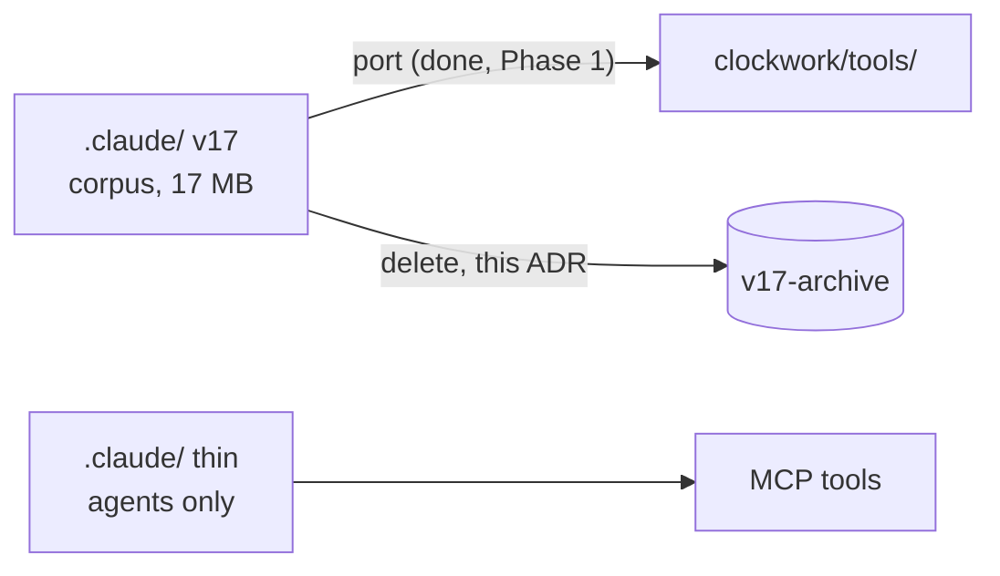
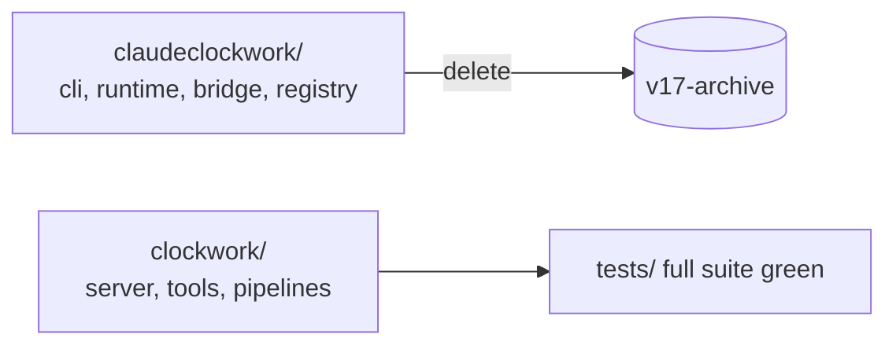
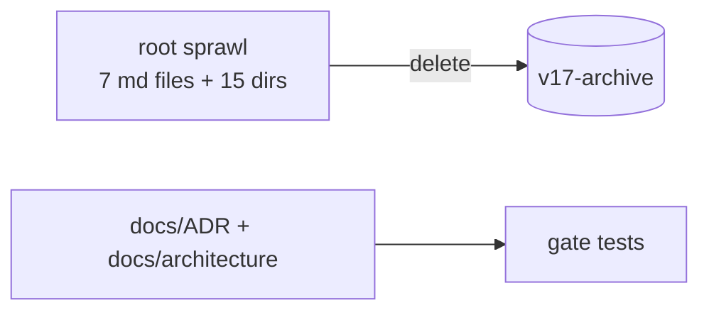
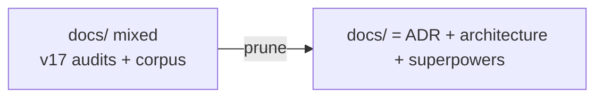
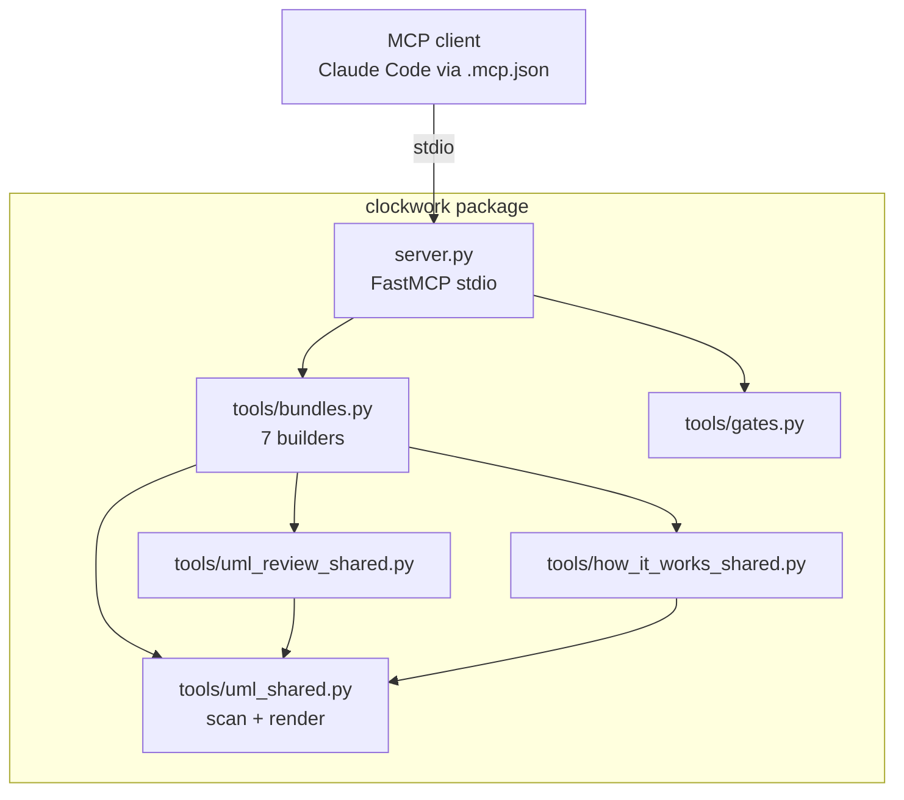
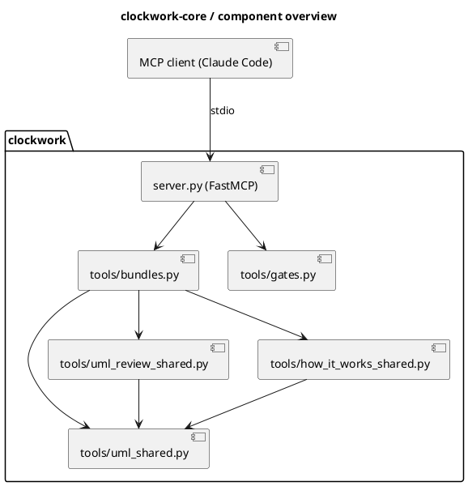
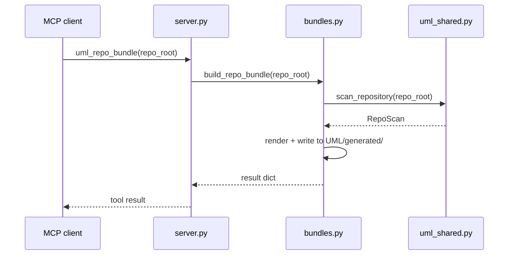
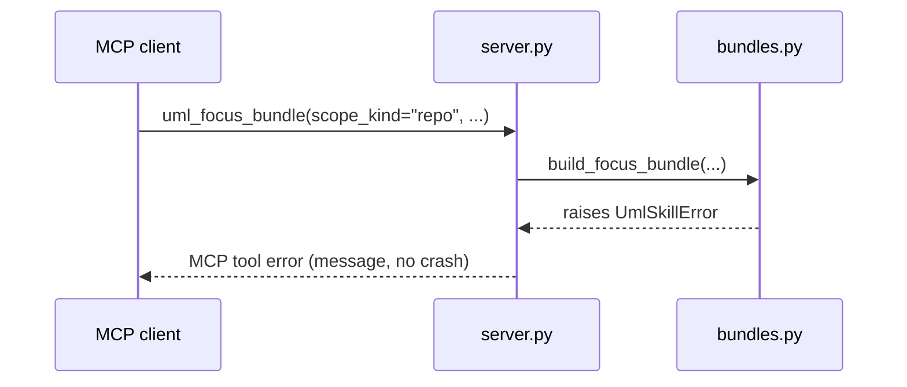
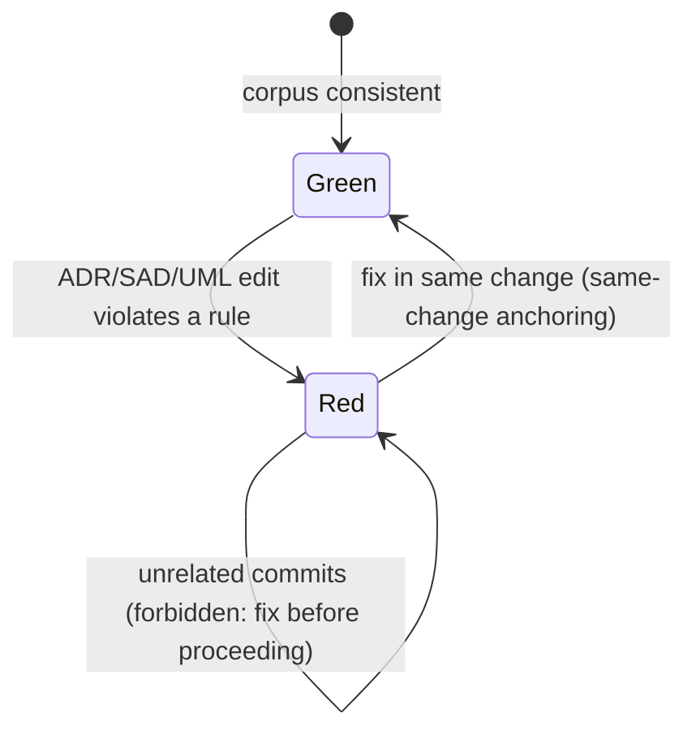

# Phase 2: Self-Application + ADR-Anchored Cleanup — Implementation Plan

> **For agentic workers:** REQUIRED SUB-SKILL: Use superpowers:subagent-driven-development (recommended) or superpowers:executing-plans to implement this plan task-by-task. Steps use checkbox (`- [ ]`) syntax for tracking.

**Goal:** Remove every remaining legacy tree via one short ADR each, generate the UML corpus with Clockwork's own tools, and leave a lean repo with a fully green suite.

**Architecture:** Each deletion task = ADR (+ catalog row) + deletion in the same commit series. Self-application extends the gate (`uml-package` existence) and creates the curated `UML/Components/clockwork-core` package from tool-generated bundles.

**Tech Stack:** git, Python (Phase 1 package), Markdown/Mermaid/PlantUML.

## Global Constraints

See `2026-07-10-reboot-overview.md`. Additional Phase 2 rules:
- Deletion pattern for every task (tracked + untracked):
  ```bash
  git rm -r -q --ignore-unmatch "<path>"; rm -rf "<path>"
  ```
- Never delete: `.claude/settings.json`, `.claude/settings.local.json` (user permissions), `.git/`, anything created in Phases 0–1.
- After every task: `python3 -m pytest tests/clockwork tests/gates -q` must stay green.

---

### Task 2.1: ADR-CW-0003 — retire the legacy `.claude/` corpus, add the thin layer

**Files:**
- Create: `docs/ADR/adr-cw-0003-retire-legacy-claude-corpus.md` + catalog row
- Create: `.claude/agents/clockwork-architect.md`
- Delete: `.claude/agents/` (legacy), `.claude/contracts/`, `.claude/governance/`, `.claude/tasks/`, `.claude/tools/`, `.claude/skills/`, `.claude/knowledge/`, `.claude/config/`, `.claude/python/`, `.claude/state/`, `.claude/SYSTEM.md`, `.claude/DEPLOY.md`, and every other legacy file under `.claude/` **except** `settings.json` / `settings.local.json`

**Interfaces:**
- Consumes: ported code from Phase 1 (nothing imports `.claude/` anymore — verify before deleting).
- Produces: thin `.claude/` layer; the `clockwork-architect` agent used for self-application in Task 2.5.

- [ ] **Step 1: Verify nothing live imports the legacy tree**

Run: `grep -rn "skills\.analysis\|claudeclockwork\.core" clockwork/ tests/clockwork/ tests/gates/ || echo NO-LEGACY-IMPORTS`
Expected: `NO-LEGACY-IMPORTS`

- [ ] **Step 2: Write the ADR**

`docs/ADR/adr-cw-0003-retire-legacy-claude-corpus.md`:

```markdown
---
id: ADR-CW-0003
status: accepted
date: 2026-07-10
domain: cleanup
---

# ADR-CW-0003: Retire the legacy .claude/ corpus

## Context

The v17 `.claude/` tree (agent hierarchy, governance markdown, ~95 JSON
schemas, 109 manifest skills, task templates, knowledge base, config) was the
normative source of a process no runtime enforced. Its useful code (UML
suite, reviewer builder) was ported to `clockwork/tools/` in Phase 1
(ADR-CW-0002). Everything remains reachable at tag `v17-archive`.

## Decision

Delete the legacy `.claude/` corpus. The Claude Code layer becomes thin:
agents/skills only, defined per ADR-CW-0002. User settings files
(`settings*.json`) are preserved.

## Consequences

- No document under `.claude/` is normative; ADRs/SADs + gate tests are.
- Ollama runtime constraints move to `clockwork.yaml` in Phase 3
  (values preserved from `.claude/config/local_ollama_runtime.yaml`,
  citable at `v17-archive`).

## Diagrams


```

Catalog row:

```markdown
| ADR-CW-0003 | Retire the legacy .claude/ corpus | cleanup | accepted | [adr-cw-0003-retire-legacy-claude-corpus.md](adr-cw-0003-retire-legacy-claude-corpus.md) |
```

- [ ] **Step 3: Create the thin agent**

`.claude/agents/clockwork-architect.md`:

```markdown
---
name: clockwork-architect
description: Maintains the ADR/SAD/UML corpus. Use after structural code changes, before phase-closing commits, or when the architecture gate is red.
tools: Read, Grep, Glob, Edit, Write, Bash
---

You maintain Clockwork's architecture documentation.

Workflow:
1. Read `docs/ADR/ADR-CATALOG.md`, then the owning SAD under
   `docs/architecture/` for the affected area.
2. Regenerate analysis input via the clockwork MCP tools
   (`uml_repo_bundle`, `review_context_build`) or
   `python3 -c "from clockwork.tools.bundles import build_repo_bundle; build_repo_bundle('.')"`.
3. Curate `UML/Components/<slug>/` from `UML/generated/` output — never
   commit `UML/generated/` itself.
4. Every structural decision gets an ADR + catalog row in the same change.
5. Finish only when `python3 -m pytest tests/gates -q` is green.
```

- [ ] **Step 4: Delete the legacy tree, preserving settings**

```bash
ls .claude/settings.json .claude/settings.local.json 2>/dev/null   # note which exist
for p in $(ls -A .claude | grep -v -E '^(settings\.json|settings\.local\.json|agents)$'); do
  git rm -r -q --ignore-unmatch ".claude/$p"; rm -rf ".claude/$p"
done
for p in $(ls -A .claude/agents | grep -v '^clockwork-architect.md$'); do
  git rm -r -q --ignore-unmatch ".claude/agents/$p"; rm -rf ".claude/agents/$p"
done
```

- [ ] **Step 5: Verify and commit**

Run: `ls -A .claude .claude/agents && python3 -m pytest tests/clockwork tests/gates -q`
Expected: only `agents` (+ preserved settings files) and `clockwork-architect.md`; tests green.

```bash
git add -A
git commit -m "chore: retire legacy .claude corpus per ADR-CW-0003; add thin architect agent"
```

---

### Task 2.2: ADR-CW-0004 — remove the old package and legacy tests

**Files:**
- Create: `docs/ADR/adr-cw-0004-remove-claudeclockwork-package.md` + catalog row
- Delete: `claudeclockwork/`, every entry in `tests/` except `tests/clockwork/`, `tests/gates/`, `tests/__init__.py`

**Interfaces:**
- Consumes: Task 2.1 (legacy `.claude/` gone — old package's skill registry has nothing to discover anyway).
- Produces: `python3 -m pytest tests/ -q` (full suite) green from here on.

- [ ] **Step 1: Write the ADR**

`docs/ADR/adr-cw-0004-remove-claudeclockwork-package.md`:

```markdown
---
id: ADR-CW-0004
status: accepted
date: 2026-07-10
domain: cleanup
---

# ADR-CW-0004: Remove the v17 claudeclockwork package and its tests

## Context

`claudeclockwork/` (CLI, runtime builder, manifest bridge, registry,
executor, planner) implemented the v17 pipeline whose contract corpus and
skill registry were retired by ADR-CW-0003. Its test suite tests removed
behavior. Replacement: `clockwork/` package (ADR-CW-0002), tested under
`tests/clockwork/` and `tests/gates/`.

## Decision

Delete `claudeclockwork/` and all legacy tests. `pyproject.toml` already
packages only `clockwork*` (Phase 1). The PyPI project name
`claudeclockwork` is kept.

## Consequences

- `python3 -m pytest tests/` is the full suite and must be green.
- Any residual reference to `claudeclockwork.` imports is a defect.

## Diagrams


```

Catalog row:

```markdown
| ADR-CW-0004 | Remove the v17 claudeclockwork package and tests | cleanup | accepted | [adr-cw-0004-remove-claudeclockwork-package.md](adr-cw-0004-remove-claudeclockwork-package.md) |
```

- [ ] **Step 2: Delete**

```bash
git rm -r -q --ignore-unmatch claudeclockwork; rm -rf claudeclockwork
for p in $(ls -A tests | grep -v -E '^(clockwork|gates|__init__\.py)$'); do
  git rm -r -q --ignore-unmatch "tests/$p"; rm -rf "tests/$p"
done
```

- [ ] **Step 3: Verify full suite and absence of stale imports**

Run: `python3 -m pytest tests/ -q && (grep -rn "claudeclockwork" clockwork/ tests/ .claude/ docs/ADR/README.md UML/ CLAUDE.md 2>/dev/null | grep -v "pip install\|PyPI\|project name" || echo NO-STALE-REFS)`
Expected: full suite green; `NO-STALE-REFS` (references inside ADR/spec/plan history documents are fine — they describe the past).

- [ ] **Step 4: Commit**

```bash
git add -A
git commit -m "chore: remove v17 claudeclockwork package and legacy tests per ADR-CW-0004"
```

---

### Task 2.3: ADR-CW-0005 — remove dev-era archives, root sprawl, `.project/`

**Files:**
- Create: `docs/ADR/adr-cw-0005-remove-dev-archives.md` + catalog row
- Delete: `mvps/`, `roadmaps/`, `.claude-development/`, `.claude-performance/`, `.clockwork_integration/`, `KNOWLEDGE/`, `KNOWLEDGE_STRUCTURE.md`, `memory/`, `registry/`, `plugins/`, `templates/`, `demos/`, `eval/`, `scripts/`, `.project/`, `AGENTS_CATALOG.md`, `ARCHITECTURE.md`, `DEVELOPMENT.md`, `MODEL_POLICY.md`, `QUALITY_TRACKING.md`, `ROADMAP.md`, `Task.md`

**Interfaces:**
- Consumes: nothing (these trees are inert).
- Produces: clean repo root.

- [ ] **Step 1: Salvage check on `.project/`**

Run: `head -50 .project/MEMORY.md`
Decision rule: the v17 memory describes retired mechanisms (109 skills, dual dispatch, phase plans). Salvage **nothing** unless you find a fact about the *new* system not already in an ADR/SAD — if found, add it to the relevant SAD section in this same task and note it in the ADR.

- [ ] **Step 2: Write the ADR**

`docs/ADR/adr-cw-0005-remove-dev-archives.md`:

```markdown
---
id: ADR-CW-0005
status: accepted
date: 2026-07-10
domain: cleanup
---

# ADR-CW-0005: Remove v17 development archives and root document sprawl

## Context

30+ incremental phases left MVP descriptions (`mvps/`), roadmaps, three
development-archive trees, a scaffolded-but-dead plugin system (`plugins/`,
`registry/` — metadata without loader code), empty scaffold dirs
(`templates/`, `demos/`, `eval/`, `memory/`, `KNOWLEDGE/`), migration
scripts (`scripts/`), the `.project/` operational tree, and seven root-level
markdown files whose content is superseded by `docs/ADR/`,
`docs/architecture/`, and `CLAUDE.md`.

## Decision

Delete all of it. Roadmap/MVP history is process residue of the failed
incremental approach (ADR-CW-0001); design history stays at `v17-archive`.
Nothing from `.project/MEMORY.md` was salvaged: its facts describe retired
mechanisms.

## Consequences

- The repo root contains only: package, tests, docs, UML, .claude, .mcp.json,
  packaging/license/readme files.
- Future roadmap items are ADRs with status `proposed`, not roadmap files.

## Diagrams


```

Catalog row:

```markdown
| ADR-CW-0005 | Remove v17 development archives and root sprawl | cleanup | accepted | [adr-cw-0005-remove-dev-archives.md](adr-cw-0005-remove-dev-archives.md) |
```

- [ ] **Step 3: Delete**

```bash
for p in mvps roadmaps .claude-development .claude-performance .clockwork_integration \
         KNOWLEDGE KNOWLEDGE_STRUCTURE.md memory registry plugins templates demos eval \
         scripts .project AGENTS_CATALOG.md ARCHITECTURE.md DEVELOPMENT.md \
         MODEL_POLICY.md QUALITY_TRACKING.md ROADMAP.md Task.md; do
  git rm -r -q --ignore-unmatch "$p"; rm -rf "$p"
done
```

- [ ] **Step 4: Verify and commit**

Run: `python3 -m pytest tests/ -q && ls`
Expected: tests green; root shows approximately: `CLAUDE.md LICENSE README.md UML VERSION clockwork docs pyproject.toml tests` (+ dotfiles).

```bash
git add -A
git commit -m "chore: remove dev archives and root sprawl per ADR-CW-0005"
```

---

### Task 2.4: ADR-CW-0006 — legacy docs content + small leftover dirs

**Files:**
- Create: `docs/ADR/adr-cw-0006-legacy-docs-and-leftovers.md` + catalog row
- Delete: every entry in `docs/` except `ADR/`, `architecture/`, `superpowers/`; plus `.ollama/`, `.cursor/`, `.report/`, `.claude-plugin/`, `.github/` (conditional), `.wslconfig` (conditional)

**Interfaces:**
- Consumes: Phase 0 rename (docs tree is lowercase).
- Produces: `docs/` contains only the living corpus.

- [ ] **Step 1: Inspect the conditional items**

Run: `ls -A .github .github/* 2>/dev/null; cat .wslconfig 2>/dev/null; ls .ollama .cursor .report .claude-plugin 2>/dev/null`
Decision rules:
- `.github/`: if workflows only reference removed paths (`claudeclockwork`, skill runner), delete; if a generic CI file worth keeping exists, keep the directory and adapt it to run `python3 -m pytest tests/` — note the choice in the ADR.
- `.wslconfig`: a WSL host config does not belong in a repo; delete (it is 81 bytes; content is preserved at `v17-archive` — if the user needs it, it belongs at `%UserProfile%\.wslconfig` on Windows).
- `.ollama/` (contains one v17 audit script), `.cursor/`, `.report/`, `.claude-plugin/`: delete.

- [ ] **Step 2: Write the ADR** (adjust the `.github` sentence to the actual decision)

`docs/ADR/adr-cw-0006-legacy-docs-and-leftovers.md`:

```markdown
---
id: ADR-CW-0006
status: accepted
date: 2026-07-10
domain: cleanup
---

# ADR-CW-0006: Remove legacy docs content and small leftover directories

## Context

`docs/` still carries v17 audit artifacts (skill-pack readmes, runtime
notes); small root dirs remain from abandoned integrations (`.ollama/`
audit script, `.cursor/`, `.report/`, `.claude-plugin/`, `.github/`,
`.wslconfig` host config).

## Decision

Keep only `docs/ADR/`, `docs/architecture/`, `docs/superpowers/`. Delete the
leftover dirs listed above. `.github/`: deleted (default) — if Step 1 found a
keepable generic CI workflow, it was kept and adapted to run
`python3 -m pytest tests/`; this sentence then states that instead.

## Consequences

- `docs/` is exactly the living corpus plus specs/plans history.
- Any future integration dir requires an ADR before it appears.

## Diagrams


```

Catalog row:

```markdown
| ADR-CW-0006 | Remove legacy docs content and leftover dirs | cleanup | accepted | [adr-cw-0006-legacy-docs-and-leftovers.md](adr-cw-0006-legacy-docs-and-leftovers.md) |
```

- [ ] **Step 3: Delete**

```bash
for p in $(ls -A docs | grep -v -E '^(ADR|architecture|superpowers)$'); do
  git rm -r -q --ignore-unmatch "docs/$p"; rm -rf "docs/$p"
done
for p in .ollama .cursor .report .claude-plugin .wslconfig; do
  git rm -r -q --ignore-unmatch "$p"; rm -rf "$p"
done
# .github per Step 1 decision:
# either: git rm -r -q --ignore-unmatch .github; rm -rf .github
# or: edit the kept workflow to run: python3 -m pytest tests/
```

- [ ] **Step 4: Verify and commit**

Run: `python3 -m pytest tests/ -q && ls docs`
Expected: green; `ADR architecture superpowers`.

```bash
git add -A
git commit -m "chore: prune legacy docs and leftover dirs per ADR-CW-0006"
```

---

### Task 2.5: Self-application — generate and curate the UML corpus, extend the gate

**Files:**
- Modify: `clockwork/tools/gates.py` (new check: SAD `uml-package` path must exist)
- Create: `UML/Components/clockwork-core/README.md`, `TRACEABILITY.md`, `components/component_overview.md`, `components/component_overview.puml`, `sequence/tool_call_paths.md`, `states/gate_lifecycle.md`
- Test: extend `tests/clockwork/test_gates.py`

**Interfaces:**
- Consumes: `bundles.build_repo_bundle`, gate from Phase 1.
- Produces: gate v2 (uml-package existence enforced); curated component package satisfying SAD-CORE's `uml-package: UML/Components/clockwork-core`.

- [ ] **Step 1: Write the failing gate-extension test**

Append to `tests/clockwork/test_gates.py`:

```python
def test_sad_uml_package_must_exist(tmp_path):
    repo = make_docs_repo(tmp_path)
    sad = repo / "docs" / "architecture" / "core" / "architecture.md"
    sad.write_text(
        SAD_OK.replace("UML/Components/test-core", "UML/Components/ghost"),
        encoding="utf-8",
    )
    violations = check_architecture_docs(repo)
    assert any("uml-package" in v and "ghost" in v for v in violations)
```

- [ ] **Step 2: Run test to verify it fails**

Run: `python3 -m pytest tests/clockwork/test_gates.py::test_sad_uml_package_must_exist -v`
Expected: FAIL (no violation produced yet)

- [ ] **Step 3: Implement the check**

In `clockwork/tools/gates.py`, inside the SAD loop after the `owns-adrs` check, add:

```python
        uml_package = str(meta.get("uml-package", ""))
        if uml_package and not (repo_root / uml_package).is_dir():
            violations.append(
                f"{rel}: uml-package '{uml_package}' does not exist")
```

- [ ] **Step 4: Run unit tests, then the repo gate — repo gate must now be RED**

Run: `python3 -m pytest tests/clockwork/test_gates.py -v && python3 -m pytest tests/gates -v`
Expected: unit tests PASS; repo gate FAIL with `docs/architecture/core/architecture.md: uml-package 'UML/Components/clockwork-core' does not exist` — this red test *drives* the corpus creation below.

- [ ] **Step 5: Generate the analysis input with Clockwork's own tools**

```bash
python3 -c "from clockwork.tools.bundles import build_repo_bundle, build_review_context_bundle; \
print(build_repo_bundle('.')['output_dir']); print(build_review_context_bundle('.')['output_dir'])"
```

Expected: two paths under `UML/generated/` (gitignored). Open
`UML/generated/repo_bundle/repo_dependency_overview.mmd` and cross-check the
curated diagram below against reality — if module dependencies differ,
correct the curated diagram, not the generator.

- [ ] **Step 6: Create the curated package**

`UML/Components/clockwork-core/README.md`:

```markdown
# clockwork-core

MCP tool server plus analysis tools: repository scanning, UML rendering,
review bundles, documentation gates. Owning SAD:
[SAD-CW-CORE](../../../docs/architecture/core/architecture.md).

- `components/` — C4-style component views
- `sequence/` — primary and degraded tool-call paths
- `states/` — gate lifecycle

See [TRACEABILITY.md](TRACEABILITY.md) to verify claims against code and tests.
```

`UML/Components/clockwork-core/TRACEABILITY.md`:

```markdown
# Traceability

| Claim / diagram element | Code | Test |
|---|---|---|
| MCP server exposes 8 tools | `clockwork/server.py` | `tests/clockwork/test_server.py::test_server_exposes_all_tools` |
| Bundle builders write catalog/repo/focus/scope/review/guide outputs | `clockwork/tools/bundles.py` | `tests/clockwork/test_bundles.py` |
| Gate detects uncataloged ADRs, missing mermaid, broken links, missing TRACEABILITY, missing uml-package | `clockwork/tools/gates.py` | `tests/clockwork/test_gates.py` |
| Scan/render core (modules, classes, deps, PlantUML/Mermaid) | `clockwork/tools/uml_shared.py` | `tests/clockwork/test_uml_shared.py` |
| Review context + static site | `clockwork/tools/uml_review_shared.py` | `tests/clockwork/test_review_shared.py` |
| Repo-level gate green on this repository | `tests/gates/test_architecture_documentation_gate.py` | (self) |
```

`UML/Components/clockwork-core/components/component_overview.md`:

````markdown
# Component overview (C4 component level)



PlantUML companion: [component_overview.puml](component_overview.puml)
````

`UML/Components/clockwork-core/components/component_overview.puml`:



`UML/Components/clockwork-core/sequence/tool_call_paths.md`:

````markdown
# Tool call — primary and degraded paths



Degraded path (bad scope):


````

`UML/Components/clockwork-core/states/gate_lifecycle.md`:

````markdown
# Architecture documentation gate — lifecycle


````

- [ ] **Step 7: Run the full suite — repo gate must be green again**

Run: `python3 -m pytest tests/ -v`
Expected: all PASS, including `test_architecture_documentation_gate`.

- [ ] **Step 8: Commit**

```bash
git add clockwork/tools/gates.py tests/clockwork/test_gates.py UML/Components/
git commit -m "feat: self-applied UML corpus for clockwork-core; gate enforces uml-package"
```

---

### Task 2.6: New CLAUDE.md, README, VERSION — phase close

**Files:**
- Modify: `CLAUDE.md` (full replacement), `README.md` (full replacement), `VERSION` (content: `0.1.0`)

**Interfaces:**
- Consumes: everything above.
- Produces: entry-point documentation matching reality.

- [ ] **Step 1: Replace `CLAUDE.md`**

```markdown
# CLAUDE.md

Guidance for Claude Code when working in this repository.

## What This Repository Is

**Clockwork** — an ADR/SAD/UML-anchored orchestration toolkit: a thin Claude
Code layer, a Python MCP tool server (`clockwork/`), and (Phase 3+) LangGraph
pipelines for local Ollama models. Rebooted 2026-07 (see ADR-CW-0001); the
v17 era is archived at git tag `v17-archive`.

## Execution Protocol

1. Search `docs/ADR/ADR-CATALOG.md` before structural changes.
2. Read the owning SAD under `docs/architecture/` before changing
   cross-cutting behavior; follow its `uml-package` link for diagrams.
3. Every structural decision: ADR + catalog row in the same change
   (`docs/ADR/adr-template.md`), with at least one Mermaid diagram.
4. The gate is normative: `python3 -m pytest tests/gates -q` must be green
   before any commit that touches docs/ADR, docs/architecture, or UML/.

## Commands

```bash
python3 -m pytest tests/ -v          # full suite
python3 -m pytest tests/gates -q     # architecture documentation gate
python3 -m clockwork.server          # MCP server (stdio); registered in .mcp.json
python3 -c "from clockwork.tools.bundles import build_repo_bundle; build_repo_bundle('.')"
```

## Structure

- `clockwork/` — package: `server.py` (FastMCP), `tools/` (UML suite,
  review builder, gates), `pipelines/` (local-model graphs)
- `docs/ADR/` + `docs/architecture/` — decision corpus (normative)
- `UML/Components/<slug>/` — curated diagrams + TRACEABILITY per component;
  `UML/generated/` is tool output (gitignored)
- `.claude/agents/clockwork-architect.md` — corpus maintenance agent
- `docs/superpowers/` — specs and plans history

## Rules

- Filesystem is case-insensitive: never create paths differing only by case.
- Local-model unavailability degrades gracefully; deterministic tools never
  depend on Ollama (no FREEZE semantics — ADR-CW-0002).
- New capabilities = MCP tools with unit tests, not markdown processes.
```

- [ ] **Step 2: Replace `README.md`**

```markdown
# Clockwork

ADR/SAD/UML-anchored orchestration toolkit: Claude Code as orchestrator, a
Python MCP tool server for deterministic architecture tooling (UML
generation, review bundles, documentation gates), and LangGraph pipelines
for local Ollama models.

## Install

```bash
python3 -m pip install -e ".[dev]"        # core + tests
python3 -m pip install -e ".[dev,local]"  # + local-model pipelines
```

## Use

Register the MCP server via the checked-in `.mcp.json` (Claude Code picks it
up automatically) or run `python3 -m clockwork.server` for any MCP client.

## Architecture

Decisions live in `docs/ADR/` (catalog: `docs/ADR/ADR-CATALOG.md`),
consolidated into arc42 SADs under `docs/architecture/`, with code-aligned
UML in `UML/Components/`. Consistency is enforced by
`tests/gates/test_architecture_documentation_gate.py`.

History: the pre-reboot system (v17) is archived at git tag `v17-archive`.
```

- [ ] **Step 3: Set `VERSION`**

File content, exactly:

```
0.1.0
```

- [ ] **Step 4: Phase verification**

Run: `python3 -m pytest tests/ -q && du -sh . && git status --short`
Expected: green; total size dominated by `.git/` (working tree ≤ ~15 MB); status clean except staged edits.

- [ ] **Step 5: Commit**

```bash
git add CLAUDE.md README.md VERSION
git commit -m "docs: entry-point docs and version for the rebooted Clockwork"
```
