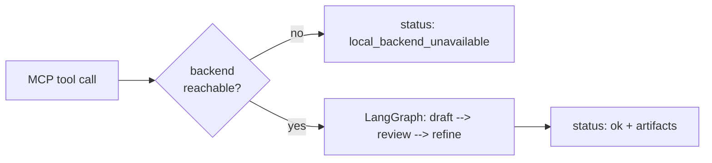
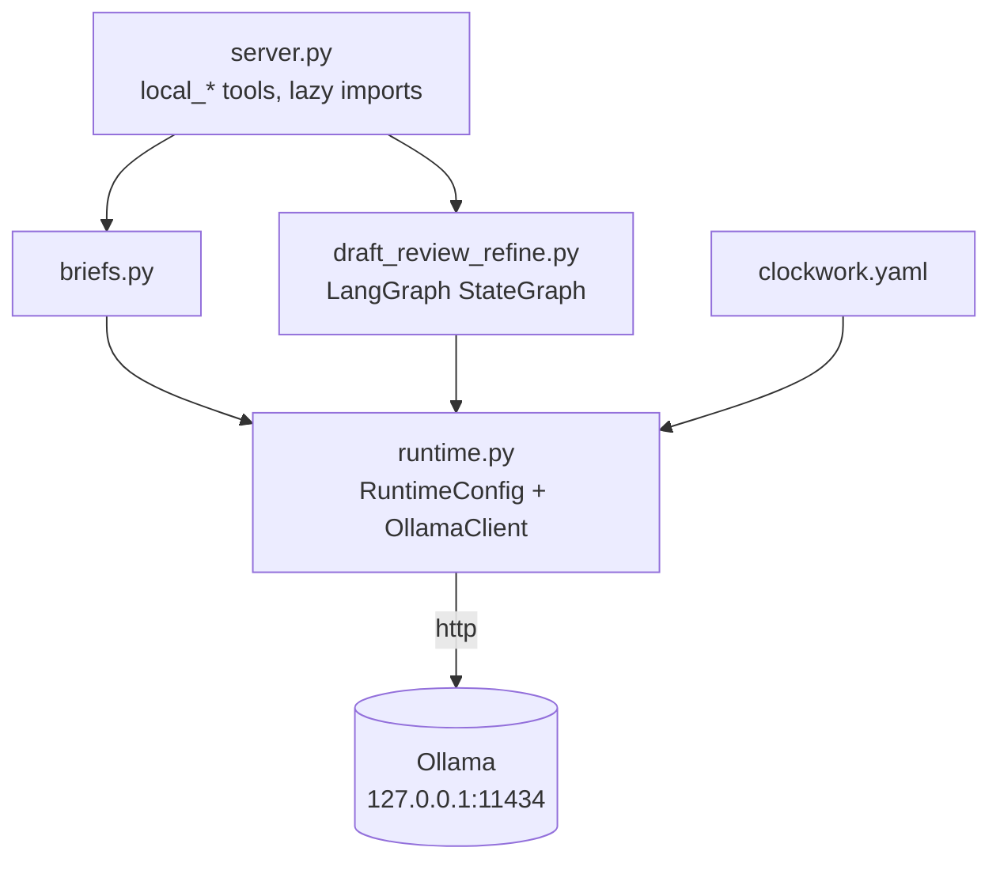
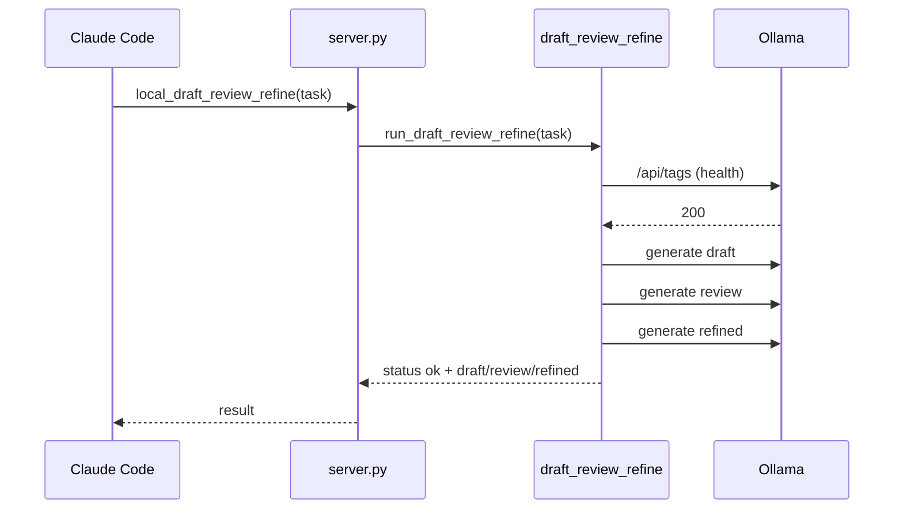
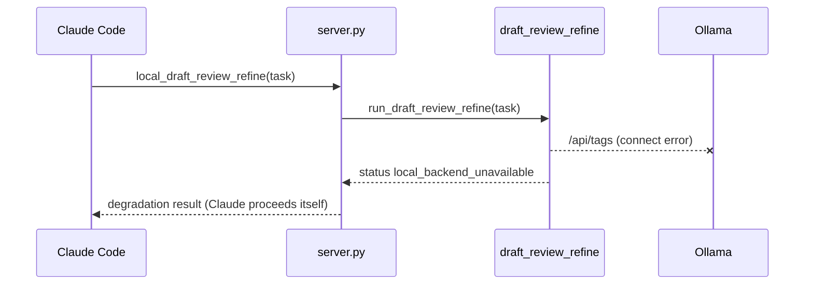
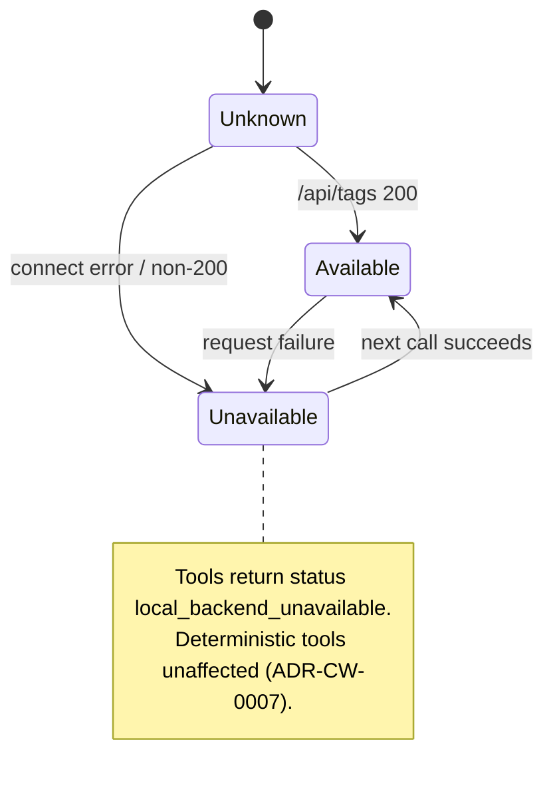

# Phase 3: Local LangGraph/Ollama Pipelines — Implementation Plan

> **For agentic workers:** REQUIRED SUB-SKILL: Use superpowers:subagent-driven-development (recommended) or superpowers:executing-plans to implement this plan task-by-task. Steps use checkbox (`- [ ]`) syntax for tracking.

**Goal:** Add the local-model layer: runtime config + Ollama client, a LangGraph draft→review→refine pipeline and a brief helper, exposed as MCP tools with graceful degradation — anchored by ADR-CW-0007, SAD-CW-LOCAL, and a `clockwork-pipelines` UML package.

**Architecture:** `clockwork/pipelines/runtime.py` (config + httpx client, GPU-first constraints preserved from v17 as data, not process) → `briefs.py` / `draft_review_refine.py` (LangGraph `StateGraph`) → three new MCP tools with lazy imports so the core install works without the `local` extra.

**Tech Stack:** `langgraph>=1.0.3,<2` (Better Tomorrow pattern), `httpx>=0.27`, PyYAML.

## Global Constraints

See `2026-07-10-reboot-overview.md`. Additional Phase 3 rules:
- No FREEZE semantics: an unreachable backend yields `{"status": "local_backend_unavailable"}`, never an exception, never a blocked deterministic tool.
- `clockwork/server.py` imports pipeline modules **inside** the tool functions (lazy) — the core install must not require `langgraph`/`httpx`.
- Unit tests never hit the network (fake client / monkeypatched httpx); only the `@pytest.mark.integration` test talks to a live backend and skips when unreachable.

---

### Task 3.1: ADR-CW-0007 + install the `local` extra

**Files:**
- Create: `docs/ADR/adr-cw-0007-local-pipelines.md` + catalog row

**Interfaces:**
- Consumes: ADR-CW-0002 (layer 3 placeholder).
- Produces: the normative decision all Phase 3 code cites.

- [ ] **Step 1: Write the ADR**

`docs/ADR/adr-cw-0007-local-pipelines.md`:

```markdown
---
id: ADR-CW-0007
status: accepted
date: 2026-07-10
domain: pipelines
---

# ADR-CW-0007: Local-model pipelines via LangGraph over Ollama

## Context

ADR-CW-0002 reserves layer 3 for local-model workflows. The v17 system
gated work on Ollama availability (FREEZE / FAIL_CLOSED in
`local_ollama_runtime.yaml`, see `v17-archive`) — a root cause of stalls.
Better Tomorrow (WorldOfShadows `ai_stack/`) demonstrates LangGraph
(`>=1.0.3,<2`) as a proven orchestration pattern.

## Decision

- Multi-step local workflows are LangGraph `StateGraph`s in
  `clockwork/pipelines/`, exposed as MCP tools (`local_health`,
  `local_brief`, `local_draft_review_refine`).
- Runtime settings live in `clockwork.yaml` (repo root). The v17 GPU-first
  constraints survive as **data**: default `qwen3:8b`, fallback `phi4`,
  forbidden 32B/70B/72B models (`ForbiddenModelError` on explicit request).
- Degradation replaces FREEZE: unreachable backend →
  `{"status": "local_backend_unavailable"}`; deterministic tools are never
  affected. Dependencies are the optional `local` extra.

## Consequences

- Claude decides per call whether to use local results; nothing blocks.
- New graphs require their own ADR (scope guard from the reboot spec).
- Model changes are one-line `clockwork.yaml` edits.

## Diagrams


```

Catalog row:

```markdown
| ADR-CW-0007 | Local-model pipelines via LangGraph over Ollama | pipelines | accepted | [adr-cw-0007-local-pipelines.md](adr-cw-0007-local-pipelines.md) |
```

- [ ] **Step 2: Install the extra and verify gate**

Run: `python3 -m pip install -e ".[dev,local]" && python3 -m pytest tests/gates -q`
Expected: langgraph + httpx installed; gate green.

- [ ] **Step 3: Commit**

```bash
git add docs/ADR/
git commit -m "docs: ADR-CW-0007 local pipelines decision"
```

---

### Task 3.2: Runtime config + Ollama client

**Files:**
- Create: `clockwork.yaml` (repo root), `clockwork/pipelines/runtime.py`
- Test: `tests/clockwork/test_pipelines_runtime.py`

**Interfaces:**
- Consumes: PyYAML, httpx.
- Produces (used by Tasks 3.3–3.4): `RuntimeConfig` (frozen dataclass: `base_url`, `default_model`, `fallback_model`, `forbidden_models: tuple[str, ...]`, `connect_timeout`, `health_timeout`, `request_timeout`, `num_ctx`), `load_runtime_config(path: str | Path | None = None) -> RuntimeConfig`, `ForbiddenModelError`, `OllamaClient` with `is_available() -> bool` and `generate(prompt: str, model: str | None = None, system: str | None = None) -> str` (auto-fallback to `fallback_model` on HTTP 404).

- [ ] **Step 1: Write the failing test**

`tests/clockwork/test_pipelines_runtime.py`:

```python
import httpx
import pytest

from clockwork.pipelines.runtime import (
    ForbiddenModelError,
    OllamaClient,
    RuntimeConfig,
    load_runtime_config,
)


def test_defaults_without_config_file(tmp_path):
    config = load_runtime_config(tmp_path / "missing.yaml")
    assert config.base_url == "http://127.0.0.1:11434"
    assert config.default_model == "qwen3:8b"
    assert "llama3.3:70b" in config.forbidden_models


def test_yaml_overrides(tmp_path):
    cfg = tmp_path / "clockwork.yaml"
    cfg.write_text(
        "ollama:\n  default_model: phi4\n  timeouts:\n    request: 60\n",
        encoding="utf-8",
    )
    config = load_runtime_config(cfg)
    assert config.default_model == "phi4"
    assert config.request_timeout == 60
    assert config.base_url == "http://127.0.0.1:11434"  # untouched default


def test_forbidden_model_hard_fails():
    client = OllamaClient(RuntimeConfig())
    with pytest.raises(ForbiddenModelError):
        client.generate("hi", model="llama3.3:70b")


def test_is_available_false_on_connect_error(monkeypatch):
    def boom(*args, **kwargs):
        raise httpx.ConnectError("refused")

    monkeypatch.setattr(httpx, "get", boom)
    assert OllamaClient(RuntimeConfig()).is_available() is False


def test_generate_falls_back_on_404(monkeypatch):
    calls: list[str] = []

    class FakeResponse:
        def __init__(self, status_code, payload):
            self.status_code = status_code
            self._payload = payload

        def raise_for_status(self):
            if self.status_code >= 400:
                raise httpx.HTTPStatusError(
                    "err", request=httpx.Request("POST", "http://x"),
                    response=httpx.Response(self.status_code),
                )

        def json(self):
            return self._payload

    def fake_post(url, json=None, timeout=None):
        calls.append(json["model"])
        if json["model"] == "qwen3:8b":
            return FakeResponse(404, {})
        return FakeResponse(200, {"response": "pong"})

    monkeypatch.setattr(httpx, "post", fake_post)
    client = OllamaClient(RuntimeConfig())
    assert client.generate("ping") == "pong"
    assert calls == ["qwen3:8b", "phi4"]
```

- [ ] **Step 2: Run test to verify it fails**

Run: `python3 -m pytest tests/clockwork/test_pipelines_runtime.py -v`
Expected: FAIL with `ModuleNotFoundError: No module named 'clockwork.pipelines.runtime'`

- [ ] **Step 3: Implement**

`clockwork.yaml` (repo root, committed — values carried over from v17 `local_ollama_runtime.yaml`, citable at `v17-archive`):

```yaml
# Local model runtime. GPU-first constraints preserved as data (ADR-CW-0007).
ollama:
  base_url: "http://127.0.0.1:11434"
  default_model: "qwen3:8b"
  fallback_model: "phi4"
  forbidden_models:
    - "qwen2.5:32b"
    - "qwen2.5-coder:32b"
    - "qwen2.5:72b"
    - "llama3.3:70b"
    - "llama2:70b"
  timeouts:
    connect: 10
    health: 15
    request: 300
  num_ctx: 4096
```

`clockwork/pipelines/runtime.py`:

```python
"""Local Ollama runtime: config loading and a minimal blocking client."""

from __future__ import annotations

from dataclasses import dataclass, field
from pathlib import Path

import httpx
import yaml

DEFAULT_FORBIDDEN = (
    "qwen2.5:32b",
    "qwen2.5-coder:32b",
    "qwen2.5:72b",
    "llama3.3:70b",
    "llama2:70b",
)


class ForbiddenModelError(RuntimeError):
    """Raised when a forbidden (non-GPU-first) model is explicitly requested."""


@dataclass(frozen=True)
class RuntimeConfig:
    base_url: str = "http://127.0.0.1:11434"
    default_model: str = "qwen3:8b"
    fallback_model: str = "phi4"
    forbidden_models: tuple[str, ...] = DEFAULT_FORBIDDEN
    connect_timeout: float = 10.0
    health_timeout: float = 15.0
    request_timeout: float = 300.0
    num_ctx: int = 4096


def load_runtime_config(path: str | Path | None = None) -> RuntimeConfig:
    candidate = Path(path) if path else Path("clockwork.yaml")
    if not candidate.exists():
        return RuntimeConfig()
    raw = yaml.safe_load(candidate.read_text(encoding="utf-8")) or {}
    section = raw.get("ollama") or {}
    timeouts = section.get("timeouts") or {}
    defaults = RuntimeConfig()
    return RuntimeConfig(
        base_url=section.get("base_url", defaults.base_url),
        default_model=section.get("default_model", defaults.default_model),
        fallback_model=section.get("fallback_model", defaults.fallback_model),
        forbidden_models=tuple(section.get("forbidden_models", defaults.forbidden_models)),
        connect_timeout=float(timeouts.get("connect", defaults.connect_timeout)),
        health_timeout=float(timeouts.get("health", defaults.health_timeout)),
        request_timeout=float(timeouts.get("request", defaults.request_timeout)),
        num_ctx=int(section.get("num_ctx", defaults.num_ctx)),
    )


class OllamaClient:
    def __init__(self, config: RuntimeConfig | None = None) -> None:
        self.config = config or load_runtime_config()

    def is_available(self) -> bool:
        try:
            response = httpx.get(
                f"{self.config.base_url}/api/tags",
                timeout=self.config.health_timeout,
            )
            return response.status_code == 200
        except httpx.HTTPError:
            return False

    def _post_generate(self, model: str, prompt: str, system: str | None):
        payload: dict = {
            "model": model,
            "prompt": prompt,
            "stream": False,
            "options": {"num_ctx": self.config.num_ctx},
        }
        if system:
            payload["system"] = system
        return httpx.post(
            f"{self.config.base_url}/api/generate",
            json=payload,
            timeout=self.config.request_timeout,
        )

    def generate(self, prompt: str, model: str | None = None,
                 system: str | None = None) -> str:
        chosen = model or self.config.default_model
        if chosen in self.config.forbidden_models:
            raise ForbiddenModelError(
                f"Model '{chosen}' is forbidden (GPU-first constraint, ADR-CW-0007).")
        response = self._post_generate(chosen, prompt, system)
        if response.status_code == 404 and chosen != self.config.fallback_model:
            response = self._post_generate(self.config.fallback_model, prompt, system)
        response.raise_for_status()
        return str(response.json().get("response", ""))
```

- [ ] **Step 4: Run test to verify it passes**

Run: `python3 -m pytest tests/clockwork/test_pipelines_runtime.py -v`
Expected: 5 PASSED

- [ ] **Step 5: Commit**

```bash
git add clockwork.yaml clockwork/pipelines/runtime.py tests/clockwork/test_pipelines_runtime.py
git commit -m "feat: local runtime config and Ollama client with fallback + forbidden-model guard"
```

---

### Task 3.3: LangGraph pipeline + brief helper

**Files:**
- Create: `clockwork/pipelines/draft_review_refine.py`, `clockwork/pipelines/briefs.py`
- Test: `tests/clockwork/test_pipelines_graph.py`

**Interfaces:**
- Consumes: `OllamaClient` (Task 3.2), `langgraph.graph.StateGraph`.
- Produces (used by Task 3.4): `run_draft_review_refine(task: str, model: str | None = None, client: OllamaClient | None = None) -> dict` (keys on success: `status="ok"`, `task`, `draft`, `review`, `refined`; on degradation: `status="local_backend_unavailable"`, `task`) and `run_brief(task: str, model: str | None = None, client: OllamaClient | None = None) -> dict` (`status`, `brief`).

- [ ] **Step 1: Write the failing test**

`tests/clockwork/test_pipelines_graph.py`:

```python
from clockwork.pipelines.briefs import run_brief
from clockwork.pipelines.draft_review_refine import run_draft_review_refine


class FakeClient:
    def __init__(self, available: bool = True):
        self.available = available
        self.prompts: list[str] = []

    def is_available(self) -> bool:
        return self.available

    def generate(self, prompt, model=None, system=None) -> str:
        self.prompts.append(prompt)
        return f"out-{len(self.prompts)}"


def test_pipeline_runs_three_steps_in_order():
    client = FakeClient()
    result = run_draft_review_refine("build a parser", client=client)
    assert result["status"] == "ok"
    assert result["draft"] == "out-1"
    assert result["review"] == "out-2"
    assert result["refined"] == "out-3"
    assert "build a parser" in client.prompts[0]
    assert "out-1" in client.prompts[1]      # review sees the draft
    assert "out-2" in client.prompts[2]      # refine sees the review


def test_pipeline_degrades_without_backend():
    result = run_draft_review_refine("x", client=FakeClient(available=False))
    assert result == {"status": "local_backend_unavailable", "task": "x"}


def test_brief_roundtrip_and_degradation():
    ok = run_brief("summarize this repo", client=FakeClient())
    assert ok["status"] == "ok" and ok["brief"] == "out-1"
    down = run_brief("x", client=FakeClient(available=False))
    assert down["status"] == "local_backend_unavailable"
```

- [ ] **Step 2: Run test to verify it fails**

Run: `python3 -m pytest tests/clockwork/test_pipelines_graph.py -v`
Expected: FAIL with `ModuleNotFoundError: No module named 'clockwork.pipelines.briefs'`

- [ ] **Step 3: Implement**

`clockwork/pipelines/briefs.py`:

```python
"""Single-step local brief (v17 ollama_brief essence, degradation-safe)."""

from __future__ import annotations

from clockwork.pipelines.runtime import OllamaClient

BRIEF_SYSTEM = (
    "You produce short, structured work briefs: goal, constraints, "
    "suggested steps. Be concrete and terse."
)


def run_brief(task: str, model: str | None = None,
              client: OllamaClient | None = None) -> dict:
    client = client or OllamaClient()
    if not client.is_available():
        return {"status": "local_backend_unavailable", "task": task}
    brief = client.generate(task, model=model, system=BRIEF_SYSTEM)
    return {"status": "ok", "task": task, "brief": brief}
```

`clockwork/pipelines/draft_review_refine.py`:

```python
"""Draft -> review -> refine LangGraph pipeline over the local backend."""

from __future__ import annotations

from typing import TypedDict

from langgraph.graph import END, START, StateGraph

from clockwork.pipelines.runtime import OllamaClient


class PipelineState(TypedDict, total=False):
    task: str
    model: str | None
    draft: str
    review: str
    refined: str


def _build_graph(client: OllamaClient):
    def draft_node(state: PipelineState) -> dict:
        prompt = f"Draft a solution for the following task:\n{state['task']}"
        return {"draft": client.generate(prompt, model=state.get("model"))}

    def review_node(state: PipelineState) -> dict:
        prompt = (
            "Review this draft critically. List concrete defects and "
            f"improvements.\n\nTask:\n{state['task']}\n\nDraft:\n{state['draft']}"
        )
        return {"review": client.generate(prompt, model=state.get("model"))}

    def refine_node(state: PipelineState) -> dict:
        prompt = (
            "Rewrite the draft applying the review feedback. Return only the "
            f"improved result.\n\nDraft:\n{state['draft']}\n\nReview:\n{state['review']}"
        )
        return {"refined": client.generate(prompt, model=state.get("model"))}

    graph = StateGraph(PipelineState)
    graph.add_node("draft", draft_node)
    graph.add_node("review", review_node)
    graph.add_node("refine", refine_node)
    graph.add_edge(START, "draft")
    graph.add_edge("draft", "review")
    graph.add_edge("review", "refine")
    graph.add_edge("refine", END)
    return graph.compile()


def run_draft_review_refine(task: str, model: str | None = None,
                            client: OllamaClient | None = None) -> dict:
    client = client or OllamaClient()
    if not client.is_available():
        return {"status": "local_backend_unavailable", "task": task}
    app = _build_graph(client)
    result = app.invoke({"task": task, "model": model})
    return {
        "status": "ok",
        "task": task,
        "draft": result["draft"],
        "review": result["review"],
        "refined": result["refined"],
    }
```

- [ ] **Step 4: Run test to verify it passes**

Run: `python3 -m pytest tests/clockwork/test_pipelines_graph.py -v`
Expected: 3 PASSED

- [ ] **Step 5: Commit**

```bash
git add clockwork/pipelines/ tests/clockwork/test_pipelines_graph.py
git commit -m "feat: LangGraph draft-review-refine pipeline and local brief"
```

---

### Task 3.4: MCP tool exposure (lazy imports)

**Files:**
- Modify: `clockwork/server.py` (append three tools)
- Test: extend `tests/clockwork/test_server.py`

**Interfaces:**
- Consumes: Tasks 3.2–3.3.
- Produces: MCP tools `local_health`, `local_brief`, `local_draft_review_refine`.

- [ ] **Step 1: Extend the failing test**

In `tests/clockwork/test_server.py`, add to `EXPECTED_TOOLS`:

```python
    "local_health",
    "local_brief",
    "local_draft_review_refine",
```

And append:

```python
def test_local_tools_degrade_without_backend(monkeypatch):
    import clockwork.pipelines.runtime as runtime

    monkeypatch.setattr(runtime.OllamaClient, "is_available", lambda self: False)
    from clockwork.server import local_brief, local_draft_review_refine, local_health

    assert local_health()["available"] is False
    assert local_brief(task="x")["status"] == "local_backend_unavailable"
    assert local_draft_review_refine(task="x")["status"] == "local_backend_unavailable"
```

- [ ] **Step 2: Run test to verify it fails**

Run: `python3 -m pytest tests/clockwork/test_server.py -v`
Expected: FAIL (tool set incomplete / ImportError on the new names)

- [ ] **Step 3: Append to `clockwork/server.py`**

```python
@mcp.tool()
def local_health() -> dict:
    """Check whether the local Ollama backend is reachable."""
    from clockwork.pipelines.runtime import OllamaClient

    client = OllamaClient()
    return {"available": client.is_available(),
            "base_url": client.config.base_url,
            "default_model": client.config.default_model}


@mcp.tool()
def local_brief(task: str, model: str | None = None) -> dict:
    """Produce a short work brief via the local model (degrades gracefully)."""
    from clockwork.pipelines.briefs import run_brief

    return run_brief(task, model=model)


@mcp.tool()
def local_draft_review_refine(task: str, model: str | None = None) -> dict:
    """Run the draft->review->refine LangGraph pipeline on the local model."""
    from clockwork.pipelines.draft_review_refine import run_draft_review_refine

    return run_draft_review_refine(task, model=model)
```

- [ ] **Step 4: Run test to verify it passes**

Run: `python3 -m pytest tests/clockwork/test_server.py -v`
Expected: all PASSED (tool count now 11)

- [ ] **Step 5: Commit**

```bash
git add clockwork/server.py tests/clockwork/test_server.py
git commit -m "feat: expose local pipeline tools via MCP with graceful degradation"
```

---

### Task 3.5: SAD-CW-LOCAL + UML package + live integration test — phase close

**Files:**
- Create: `docs/architecture/local-pipelines/architecture.md`
- Create: `UML/Components/clockwork-pipelines/README.md`, `TRACEABILITY.md`, `components/component_overview.md`, `sequence/pipeline_paths.md`, `states/backend_availability.md`
- Test: `tests/clockwork/test_integration_local.py`

**Interfaces:**
- Consumes: everything in Phase 3; gate v2 (enforces `uml-package` existence — SAD and UML package land in the same commit).
- Produces: complete Phase 3 documentation; gate green.

- [ ] **Step 1: Write the SAD**

`docs/architecture/local-pipelines/architecture.md`:

```markdown
---
id: SAD-CW-LOCAL
status: accepted
type: project-sad
owns-adrs:
  - ADR-CW-0007
uml-package: UML/Components/clockwork-pipelines
links:
  - ../../ADR/ADR-CATALOG.md
  - ../core/architecture.md
---

# Local Pipelines — Software Architecture (arc42)

**System:** local-model pipeline layer (`clockwork/pipelines/`)
**Scope:** runtime config, Ollama client, LangGraph graphs, MCP exposure,
degradation policy
**Last reconciled:** 2026-07-10

## 1. Introduction & Goals

Give Claude Code cheap local drafting/review capacity without ever blocking
deterministic work. Owns ADR-CW-0007.

## 2. Constraints

- Optional `local` extra (`langgraph>=1.0.3,<2`, `httpx>=0.27`); core install
  stays independent (lazy imports in `clockwork/server.py`).
- GPU-first model constraints are data in `clockwork.yaml` (default
  `qwen3:8b`, fallback `phi4`, forbidden 32B/70B/72B).

## 3. Building Block View

| Module | Responsibility |
|---|---|
| `clockwork/pipelines/runtime.py` | `RuntimeConfig`, `load_runtime_config`, `OllamaClient` (health, generate, 404-fallback, forbidden-model guard) |
| `clockwork/pipelines/briefs.py` | single-step `run_brief` |
| `clockwork/pipelines/draft_review_refine.py` | LangGraph draft→review→refine graph |
| `clockwork/server.py` (local tools) | `local_health`, `local_brief`, `local_draft_review_refine` |

## 4. Runtime View

Primary and degraded paths: see
[UML/Components/clockwork-pipelines/sequence/pipeline_paths.md](../../../UML/Components/clockwork-pipelines/sequence/pipeline_paths.md).
Degradation contract: unreachable backend returns
`{"status": "local_backend_unavailable"}` — callers (Claude) decide how to
proceed; no retries, no blocking.

## 5. Quality & Testing

Unit tests are network-free (`tests/clockwork/test_pipelines_runtime.py`,
`test_pipelines_graph.py`, server degradation test). The only live test is
`tests/clockwork/test_integration_local.py` (`integration` marker,
self-skipping).
```

- [ ] **Step 2: Write the UML package**

`UML/Components/clockwork-pipelines/README.md`:

```markdown
# clockwork-pipelines

Local-model layer: runtime config, Ollama client, LangGraph pipelines,
MCP exposure with graceful degradation. Owning SAD:
[SAD-CW-LOCAL](../../../docs/architecture/local-pipelines/architecture.md).

See [TRACEABILITY.md](TRACEABILITY.md) to verify claims against code and tests.
```

`UML/Components/clockwork-pipelines/TRACEABILITY.md`:

```markdown
# Traceability

| Claim / diagram element | Code | Test |
|---|---|---|
| Config defaults + YAML overrides | `clockwork/pipelines/runtime.py` | `tests/clockwork/test_pipelines_runtime.py::test_yaml_overrides` |
| Forbidden-model hard fail | `clockwork/pipelines/runtime.py` | `tests/clockwork/test_pipelines_runtime.py::test_forbidden_model_hard_fails` |
| 404 fallback to phi4 | `clockwork/pipelines/runtime.py` | `tests/clockwork/test_pipelines_runtime.py::test_generate_falls_back_on_404` |
| Three-step graph order (draft→review→refine) | `clockwork/pipelines/draft_review_refine.py` | `tests/clockwork/test_pipelines_graph.py::test_pipeline_runs_three_steps_in_order` |
| Degradation instead of FREEZE | `briefs.py`, `draft_review_refine.py`, `server.py` | `test_pipeline_degrades_without_backend`, `test_local_tools_degrade_without_backend` |
| Live roundtrip (optional) | `clockwork/pipelines/runtime.py` | `tests/clockwork/test_integration_local.py` |
```

`UML/Components/clockwork-pipelines/components/component_overview.md`:

````markdown
# Component overview


````

`UML/Components/clockwork-pipelines/sequence/pipeline_paths.md`:

````markdown
# Pipeline paths — primary and degraded




````

`UML/Components/clockwork-pipelines/states/backend_availability.md`:

````markdown
# Backend availability — behavior states


````

- [ ] **Step 3: Write the self-skipping live test**

`tests/clockwork/test_integration_local.py`:

```python
import pytest

from clockwork.pipelines.runtime import OllamaClient


@pytest.mark.integration
def test_live_generate_roundtrip():
    client = OllamaClient()
    if not client.is_available():
        pytest.skip("local Ollama backend not reachable")
    text = client.generate("Reply with exactly one word: pong")
    assert isinstance(text, str) and text.strip()
```

- [ ] **Step 4: Full verification**

Run: `python3 -m pytest tests/ -v`
Expected: everything green; `test_live_generate_roundtrip` either PASSED (backend up) or SKIPPED — both acceptable.

Run: `python3 -m pytest tests/gates -q`
Expected: green (SAD-CW-LOCAL frontmatter valid, uml-package exists, links resolve).

- [ ] **Step 5: Commit**

```bash
git add docs/architecture/local-pipelines/ UML/Components/clockwork-pipelines/ tests/clockwork/test_integration_local.py
git commit -m "docs: SAD-CW-LOCAL and clockwork-pipelines UML package; live integration test"
```

---

### Phase 3 close — reboot complete

- [ ] **Final check against the spec**

Run: `python3 -m pytest tests/ -q && python3 -c "import asyncio; from clockwork.server import mcp; print(len(asyncio.run(mcp.list_tools())), 'MCP tools')"`
Expected: green; `11 MCP tools`.

All spec deliverables (sections 3–8) are now implemented: three layers, ADR/SAD/UML corpus with gates, self-application, local pipelines. Remaining follow-ups (new graphs, more UML packages, CI) are future ADRs, not part of this reboot.
