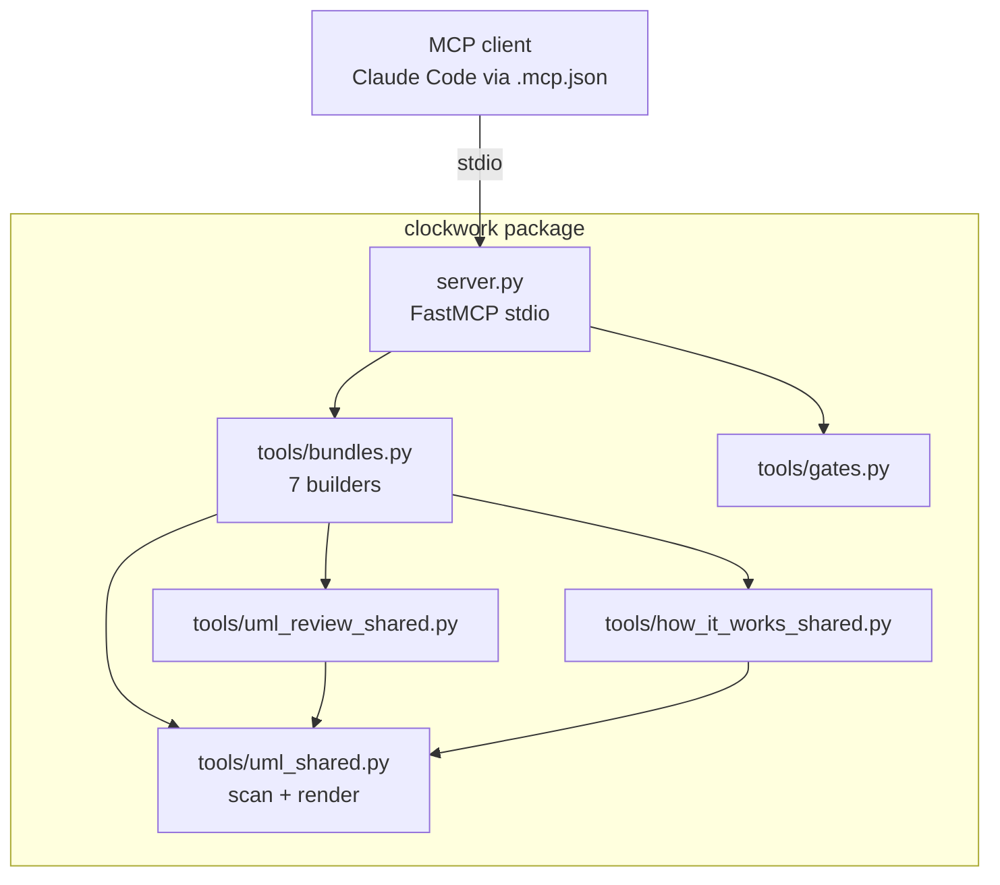

# Component overview (C4 component level)

```mermaid
flowchart TD
    CLIENT[MCP client\nClaude Code via .mcp.json]
    subgraph clockwork package
        SERVER[server.py\nFastMCP stdio]
        BUNDLES[tools/bundles.py\n7 builders]
        GATES[tools/gates.py]
        UMLC[tools/uml_shared.py\nscan + render]
        REVIEW[tools/uml_review_shared.py]
        HIW[tools/how_it_works_shared.py]
    end
    CLIENT -->|stdio| SERVER
    SERVER --> BUNDLES
    SERVER --> GATES
    BUNDLES --> UMLC
    BUNDLES --> REVIEW
    BUNDLES --> HIW
    REVIEW --> UMLC
    HIW --> UMLC
```

PlantUML companion: [component_overview.puml](component_overview.puml)
