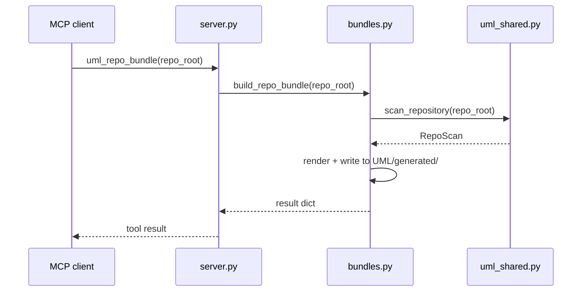
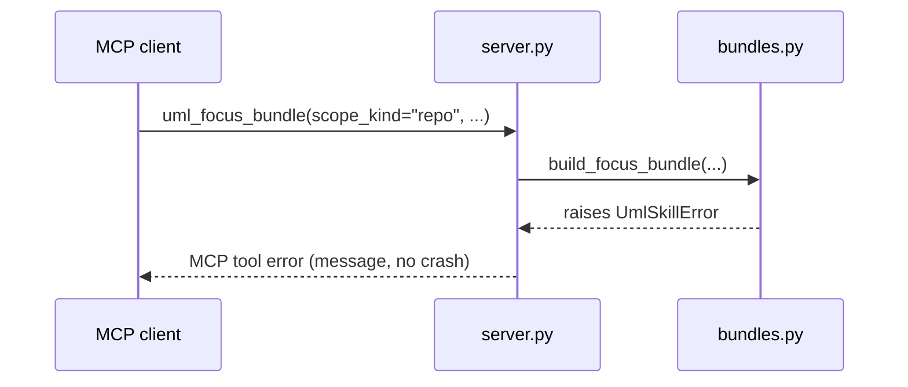

# Tool call - primary and degraded paths

```mermaid
sequenceDiagram
    participant C as MCP client
    participant S as server.py
    participant B as bundles.py
    participant U as uml_shared.py
    C->>S: uml_repo_bundle(repo_root)
    S->>B: build_repo_bundle(repo_root)
    B->>U: scan_repository(repo_root)
    U-->>B: RepoScan
    B->>B: render + write to UML/generated/
    B-->>S: result dict
    S-->>C: tool result
```

Degraded path (bad scope):

```mermaid
sequenceDiagram
    participant C as MCP client
    participant S as server.py
    participant B as bundles.py
    C->>S: uml_focus_bundle(scope_kind="repo", ...)
    S->>B: build_focus_bundle(...)
    B-->>S: raises UmlSkillError
    S-->>C: MCP tool error (message, no crash)
```
