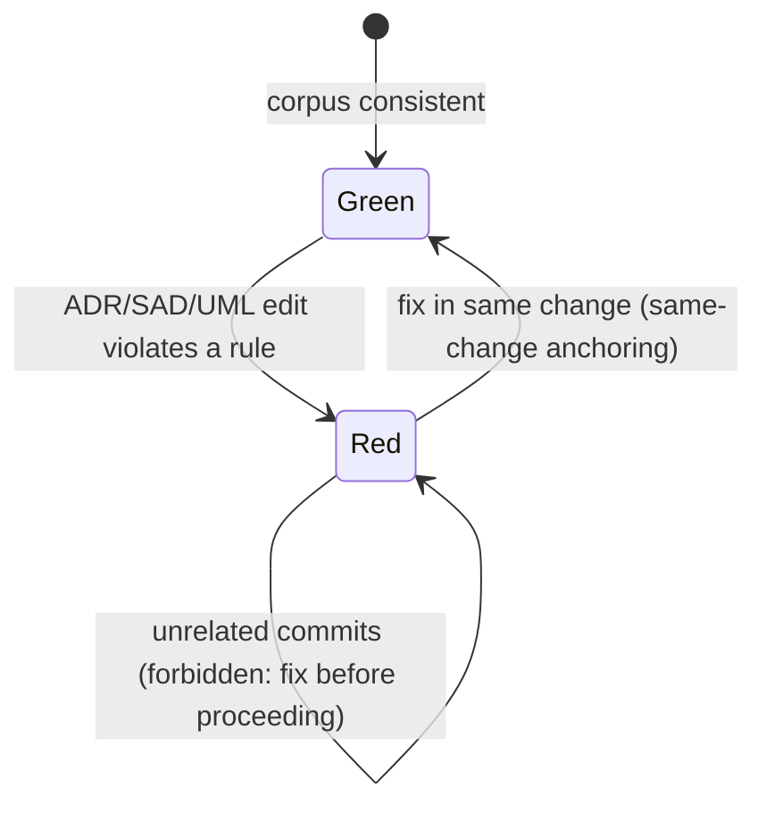

# Architecture documentation gate - lifecycle

```mermaid
stateDiagram-v2
    [*] --> Green: corpus consistent
    Green --> Red: ADR/SAD/UML edit violates a rule
    Red --> Green: fix in same change (same-change anchoring)
    Red --> Red: unrelated commits (forbidden: fix before proceeding)
```
