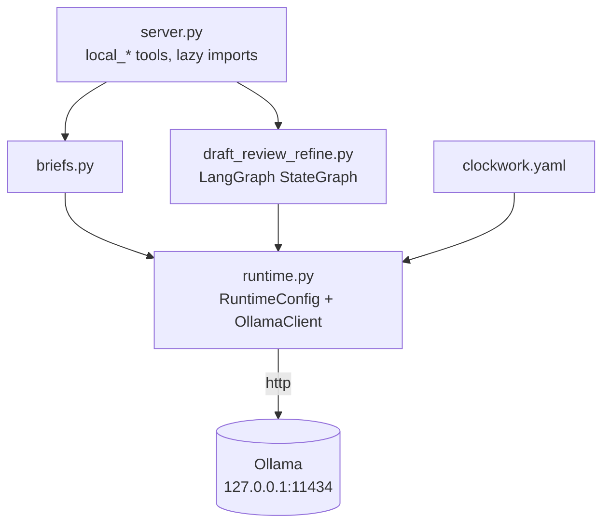

# Component overview

```mermaid
flowchart TD
    S[server.py\nlocal_* tools, lazy imports] --> B[briefs.py]
    S --> G[draft_review_refine.py\nLangGraph StateGraph]
    B --> R[runtime.py\nRuntimeConfig + OllamaClient]
    G --> R
    R -->|http| O[(Ollama\n127.0.0.1:11434)]
    C[clockwork.yaml] --> R
```
