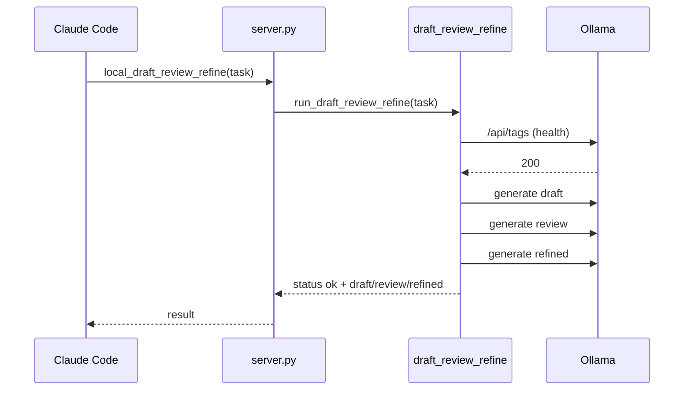
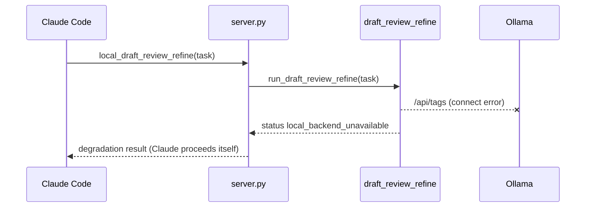

# Pipeline paths - primary and degraded

```mermaid
sequenceDiagram
    participant CC as Claude Code
    participant S as server.py
    participant P as draft_review_refine
    participant O as Ollama
    CC->>S: local_draft_review_refine(task)
    S->>P: run_draft_review_refine(task)
    P->>O: /api/tags (health)
    O-->>P: 200
    P->>O: generate draft
    P->>O: generate review
    P->>O: generate refined
    P-->>S: status ok + draft/review/refined
    S-->>CC: result
```

```mermaid
sequenceDiagram
    participant CC as Claude Code
    participant S as server.py
    participant P as draft_review_refine
    participant O as Ollama
    CC->>S: local_draft_review_refine(task)
    S->>P: run_draft_review_refine(task)
    P--xO: /api/tags (connect error)
    P-->>S: status local_backend_unavailable
    S-->>CC: degradation result (Claude proceeds itself)
```
