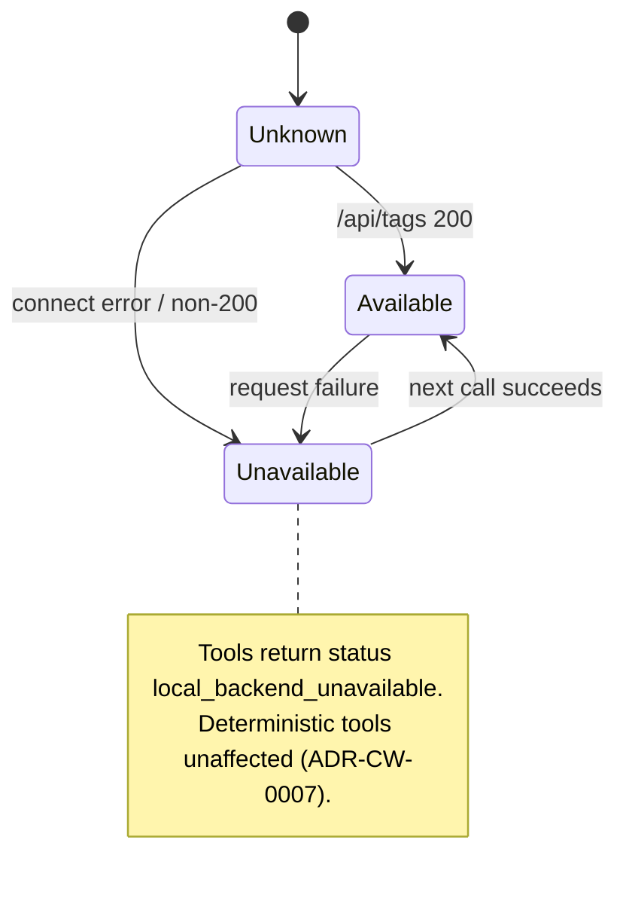

# Backend availability - behavior states

```mermaid
stateDiagram-v2
    [*] --> Unknown
    Unknown --> Available: /api/tags 200
    Unknown --> Unavailable: connect error / non-200
    Available --> Unavailable: request failure
    Unavailable --> Available: next call succeeds
    note right of Unavailable
        Tools return status local_backend_unavailable.
        Deterministic tools unaffected (ADR-CW-0007).
    end note
```
