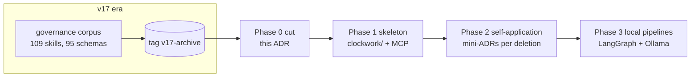

# ADR-CW-0001: Reboot Clockwork in the same repo; archive v17 via git history

## Context

ClaudeClockwork v17.x (last commit 2026-03-30, tag `v17-archive`) never worked
reliably: a governance-markdown corpus (109 manifest skills, ~95 JSON schemas,
agent hierarchy, escalation levels) that no runtime enforced end-to-end,
hard-blocking rules (Ollama FREEZE), and ~700 MB of accumulated artifacts.
The full analysis and the approved target design live in
`docs/superpowers/specs/2026-07-10-clockwork-reboot-design.md`.

## Decision

Restart in the same repository. Git history (tag `v17-archive`) is the only
archive. Only the UML suite, the reviewer builder, and the Ollama runtime
essentials are ported (Phase 1/3). Decision-free junk is deleted immediately
(this ADR); every decision-bearing deletion gets its own short ADR (Phase 2).
The new system is defined by ADR/SAD/UML artifacts validated by gate tests,
not by process prose.

Deleted as decision-free junk (not tracked or pure artifact output):
`.clockwork_runtime/`, `.worktrees/`, `claudeclockwork.zip`, `.DEPRECATED/`,
`.ollama_old/`, `.ollama_from_wos/`, `.llama_runtime/`, `.pytest_cache/`,
`validation_runs/`, `validation_runs_redacted/`, `cleanup_request.json`,
`cleanup_run.log`, `phase6_evidence_bundle.json`, stray root file `skills`.

## Consequences

- The repo shrinks by ~610 MB; nothing is lost (git history + tag).
- No code or doc may cite the deleted paths as live locations anymore.
- Every future structural decision requires an ADR in the same change.
- The FREEZE rule is retired; degradation policy is decided in the
  pipelines ADR (Phase 3).

## Diagrams

