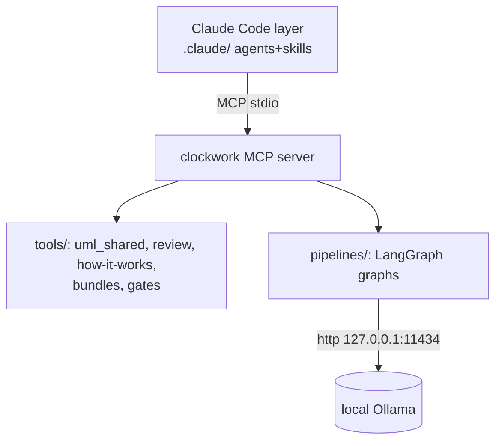

# ADR-CW-0002: Three-layer architecture (Claude Code + MCP tools + local pipelines)

## Context

The v17 system mixed orchestration, governance prose, skill dispatch and
model routing into one custom pipeline that no runtime enforced. The reboot
spec (`docs/superpowers/specs/2026-07-10-clockwork-reboot-design.md`) fixes a
hybrid foundation.

## Decision

Clockwork consists of exactly three layers:

1. **Claude Code layer** (`.claude/`): a thin set of agents/skills; Claude
   Code is the orchestrator. No governance prose, no skill registry.
2. **MCP tool server** (`clockwork/` package, FastMCP over stdio): the seven
   bundle builders (scope catalog, repo bundle, focus bundle, diagram set,
   review context, review site, how-it-works) plus `architecture_gate`.
   The v17 combo skills (`uml_review_bundle`, `uml_review_knowledge_bundle`)
   are dropped; callers compose tools instead.
3. **Local pipelines** (`clockwork/pipelines/`, Phase 3): LangGraph graphs
   over local Ollama, exposed as MCP tools, degrading gracefully when the
   backend is unavailable.

Deterministic capabilities never depend on local-model availability.

## Consequences

- New capabilities are added as MCP tools with unit tests, not as manifest
  skills; `.claude/` stays thin.
- Gate rules live in `clockwork/tools/gates.py` and run in pytest; drift is
  a red test.
- The old FREEZE rule is retired (degradation policy: Phase 3 ADR).

## Diagrams

