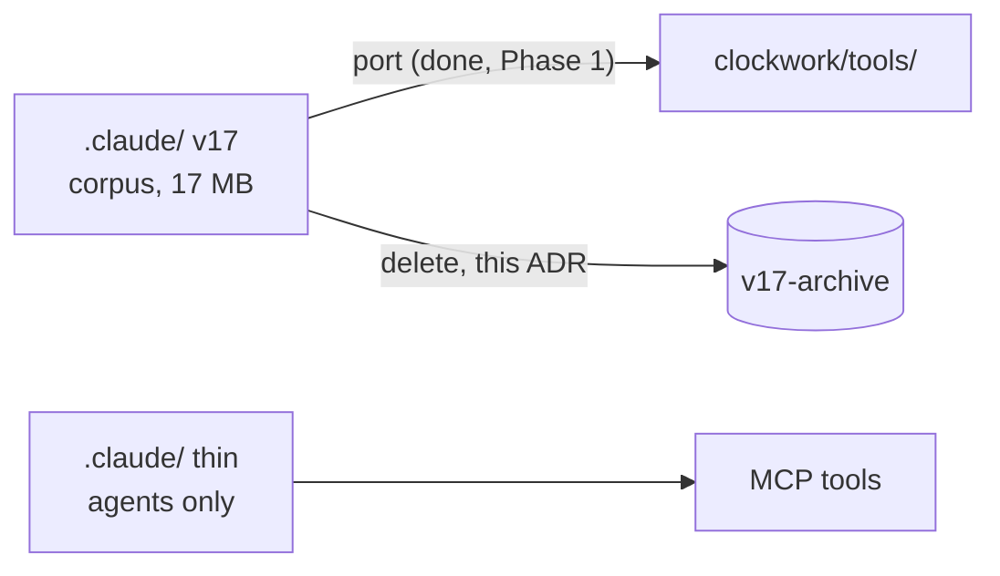

# ADR-CW-0003: Retire the legacy .claude/ corpus

## Context

The v17 `.claude/` tree (agent hierarchy, governance markdown, ~95 JSON
schemas, 109 manifest skills, task templates, knowledge base, config) was the
normative source of a process no runtime enforced. Its useful code (UML
suite, reviewer builder) was ported to `clockwork/tools/` in Phase 1
(ADR-CW-0002). Everything remains reachable at tag `v17-archive`.

## Decision

Delete the legacy `.claude/` corpus. The Claude Code layer becomes thin:
agents/skills only, defined per ADR-CW-0002. User settings files
(`settings*.json`) are preserved.

## Consequences

- No document under `.claude/` is normative; ADRs/SADs + gate tests are.
- Ollama runtime constraints move to `clockwork.yaml` in Phase 3
  (values preserved from `.claude/config/local_ollama_runtime.yaml`,
  citable at `v17-archive`).

## Diagrams

