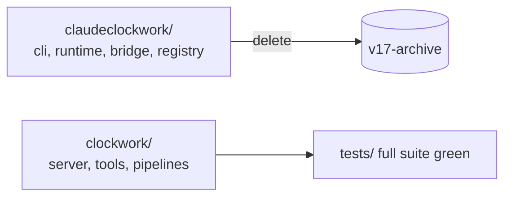

# ADR-CW-0004: Remove the v17 claudeclockwork package and its tests

## Context

`claudeclockwork/` (CLI, runtime builder, manifest bridge, registry,
executor, planner) implemented the v17 pipeline whose contract corpus and
skill registry were retired by ADR-CW-0003. Its test suite tests removed
behavior. Replacement: `clockwork/` package (ADR-CW-0002), tested under
`tests/clockwork/` and `tests/gates/`.

## Decision

Delete `claudeclockwork/` and all legacy tests. `pyproject.toml` already
packages only `clockwork*` (Phase 1). The PyPI project name
`claudeclockwork` is kept.

## Consequences

- `python -m pytest tests/` is the full suite and must be green.
- Any residual reference to `claudeclockwork.` imports is a defect.

## Diagrams

