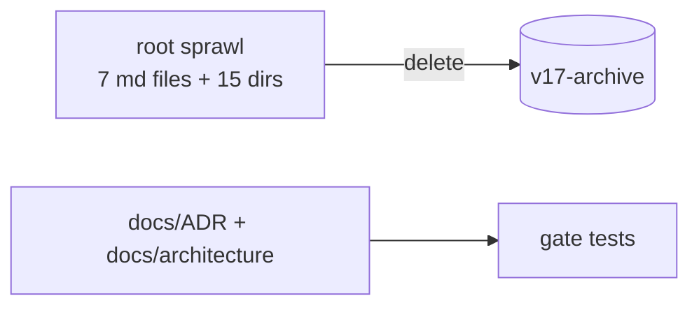

# ADR-CW-0005: Remove v17 development archives and root document sprawl

## Context

30+ incremental phases left MVP descriptions (`mvps/`), roadmaps, three
development-archive trees, a scaffolded-but-dead plugin system (`plugins/`,
`registry/` - metadata without loader code), empty scaffold dirs
(`templates/`, `demos/`, `eval/`, `memory/`, `KNOWLEDGE/`), migration
scripts (`scripts/`), the `.project/` operational tree, and seven root-level
markdown files whose content is superseded by `docs/ADR/`,
`docs/architecture/`, and `CLAUDE.md`.

## Decision

Delete all of it. Roadmap/MVP history is process residue of the failed
incremental approach (ADR-CW-0001); design history stays at `v17-archive`.
Nothing from `.project/MEMORY.md` was salvaged: its facts describe retired
mechanisms.

## Consequences

- The repo root contains only: package, tests, docs, UML, .claude, .mcp.json,
  packaging/license/readme files.
- Future roadmap items are ADRs with status `proposed`, not roadmap files.

## Diagrams

