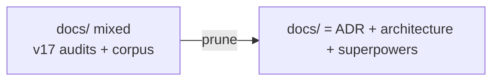

# ADR-CW-0006: Remove legacy docs content and small leftover directories

## Context

`docs/` still carries v17 audit artifacts (skill-pack readmes, runtime
notes); small root dirs remain from abandoned integrations (`.ollama/`
audit scripts, `.cursor/`, `.report/`, `.claude-plugin/`, `.github/`,
`.wslconfig` host config).

## Decision

Keep only `docs/ADR/`, `docs/architecture/`, `docs/superpowers/`. Delete the
leftover dirs listed above. `.github/` is deleted because its workflow only
referenced removed v17 paths (`.claude/tools/boot_check.py`, legacy
`tests/test_gates.py`, and `.llama_runtime` artifacts).

## Consequences

- `docs/` is exactly the living corpus plus specs/plans history.
- Any future integration dir requires an ADR before it appears.

## Diagrams

