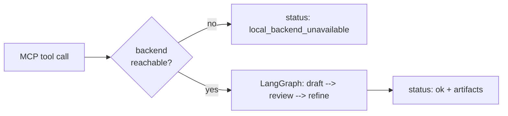

# ADR-CW-0007: Local-model pipelines via LangGraph over Ollama

## Context

ADR-CW-0002 reserves layer 3 for local-model workflows. The v17 system
gated work on Ollama availability (FREEZE / FAIL_CLOSED in
`local_ollama_runtime.yaml`, see `v17-archive`) - a root cause of stalls.
Better Tomorrow (WorldOfShadows `ai_stack/`) demonstrates LangGraph
(`>=1.0.3,<2`) as a proven orchestration pattern.

## Decision

- Multi-step local workflows are LangGraph `StateGraph`s in
  `clockwork/pipelines/`, exposed as MCP tools (`local_health`,
  `local_brief`, `local_draft_review_refine`).
- Runtime settings live in `clockwork.yaml` (repo root). The v17 GPU-first
  constraints survive as **data**: default `qwen3:8b`, fallback `phi4`,
  forbidden 32B/70B/72B models (`ForbiddenModelError` on explicit request).
- Degradation replaces FREEZE: unreachable backend ->
  `{"status": "local_backend_unavailable"}`; deterministic tools are never
  affected. Dependencies are the optional `local` extra.

## Consequences

- Claude decides per call whether to use local results; nothing blocks.
- New graphs require their own ADR (scope guard from the reboot spec).
- Model changes are one-line `clockwork.yaml` edits.

## Diagrams

